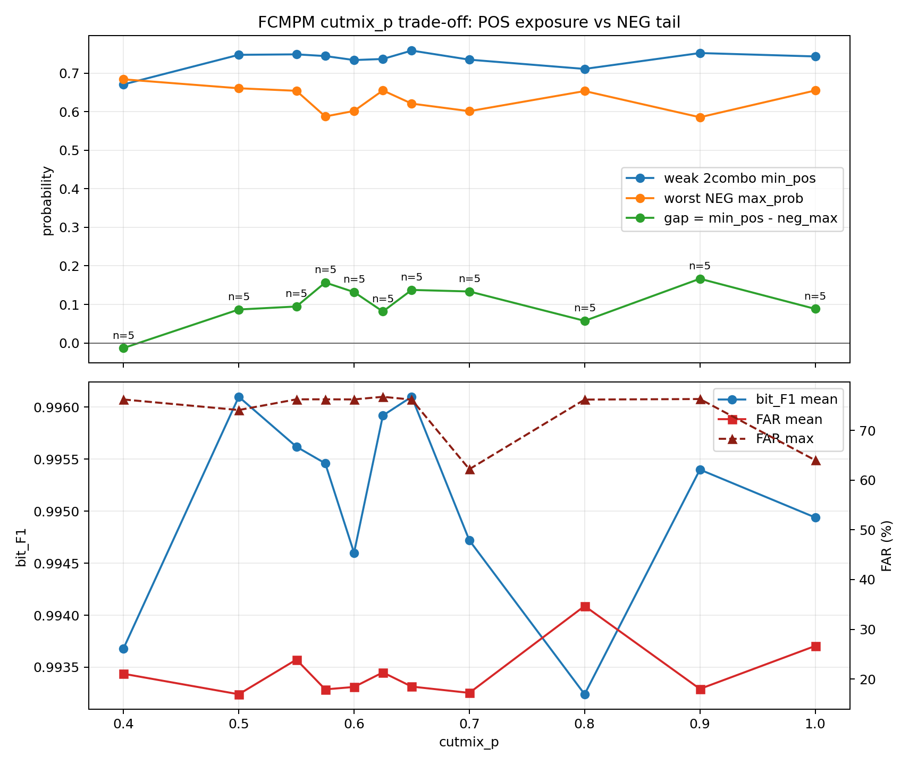

# FCMPM cutmix_p Trade-off Trend

This report separates complete multi-dataset rows from in-progress rows. Use the complete rows for conclusions.

CSV: `FCMPM_CUTMIX_P_TRADEOFF_260606.csv`

Expected dataset count: `5`

## Complete Rows

| p | n | dataset_n | seed_n | F1 mean | FAR mean | FAR max | weak 2combo min_pos | worst NEG max | gap mean |
|---:|---:|---:|---:|---:|---:|---:|---:|---:|---:|
| 0.4000 | 5 | 5 | 1 | 0.9937 | 21.06 | 76.21 | 0.671 | 0.684 | -0.013 |
| 0.5000 | 5 | 5 | 1 | 0.9961 | 16.94 | 74.09 | 0.748 | 0.661 | 0.087 |
| 0.5500 | 5 | 5 | 1 | 0.9956 | 23.91 | 76.24 | 0.749 | 0.654 | 0.095 |
| 0.5750 | 5 | 5 | 1 | 0.9955 | 17.92 | 76.24 | 0.744 | 0.588 | 0.157 |
| 0.6000 | 5 | 5 | 1 | 0.9946 | 18.41 | 76.22 | 0.734 | 0.602 | 0.132 |
| 0.6250 | 5 | 5 | 1 | 0.9959 | 21.33 | 76.75 | 0.737 | 0.655 | 0.082 |
| 0.6500 | 5 | 5 | 1 | 0.9961 | 18.49 | 76.18 | 0.759 | 0.621 | 0.138 |
| 0.7000 | 5 | 5 | 1 | 0.9947 | 17.22 | 62.19 | 0.735 | 0.601 | 0.134 |
| 0.8000 | 5 | 5 | 1 | 0.9932 | 34.69 | 76.19 | 0.711 | 0.654 | 0.057 |
| 0.9000 | 5 | 5 | 1 | 0.9954 | 18.02 | 76.30 | 0.752 | 0.586 | 0.167 |
| 1.0000 | 5 | 5 | 1 | 0.9949 | 26.65 | 64.00 | 0.743 | 0.655 | 0.088 |

## In-Progress Rows

| p | n | dataset_n | seed_n | F1 mean | FAR mean | FAR max | weak 2combo min_pos | worst NEG max | gap mean |
|---:|---:|---:|---:|---:|---:|---:|---:|---:|---:|
| 0.1000 | 1 | 1 | 1 | 0.9835 | 1.16 | 1.16 | 0.586 | 0.496 | 0.090 |
| 0.2000 | 1 | 1 | 1 | 0.9865 | 1.01 | 1.01 | 0.544 | 0.446 | 0.098 |
| 0.3000 | 1 | 1 | 1 | 0.9964 | 1.75 | 1.75 | 0.685 | 0.452 | 0.233 |

## Plot Rows

The plot uses complete rows only when `--complete-only` is set; otherwise it uses all rows for a live diagnostic.

Interpretation:

- Low `p` can under-expose FCMPM 2combo samples, keeping weak combo `min_pos` low.
- Mid `p` is the target basin: weak combo `min_pos` rises while worst NEG tails remain controlled.
- High `p` can keep F1 high but raise FAR max through OOD/Normal tail leakage.
- Promote only conditions with high F1, low FAR max, positive stable gap, and low seed/dataset variance.
