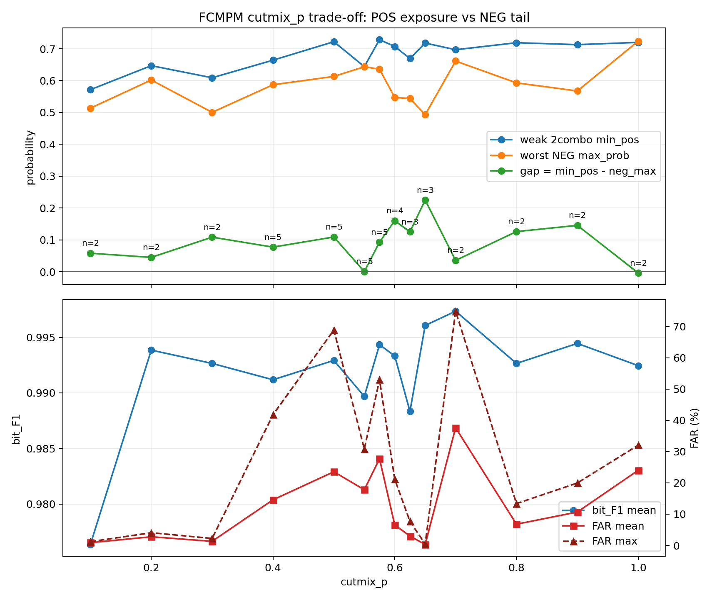

# FCMPM cutmix_p Trade-off Trend

This plot uses completed leaderboard rows only. It should be regenerated as multi-dataset and seed-repeat rows accumulate.

CSV: `FCMPM_CUTMIX_P_TRADEOFF_260606_seed.csv`

| p | n | dataset_n | seed_n | F1 mean | FAR mean | FAR max | weak 2combo min_pos | worst NEG max | gap mean |
|---:|---:|---:|---:|---:|---:|---:|---:|---:|---:|
| 0.1000 | 2 | 1 | 2 | 0.9764 | 0.88 | 1.19 | 0.572 | 0.514 | 0.058 |
| 0.2000 | 2 | 1 | 2 | 0.9939 | 2.76 | 4.06 | 0.647 | 0.602 | 0.045 |
| 0.3000 | 2 | 1 | 2 | 0.9927 | 1.31 | 2.23 | 0.609 | 0.500 | 0.109 |
| 0.4000 | 5 | 3 | 3 | 0.9912 | 14.58 | 41.78 | 0.664 | 0.587 | 0.077 |
| 0.5000 | 5 | 3 | 3 | 0.9929 | 23.56 | 68.91 | 0.722 | 0.613 | 0.109 |
| 0.5500 | 5 | 3 | 3 | 0.9897 | 17.80 | 30.83 | 0.644 | 0.644 | 0.000 |
| 0.5750 | 5 | 3 | 3 | 0.9943 | 27.72 | 52.98 | 0.729 | 0.636 | 0.093 |
| 0.6000 | 4 | 2 | 3 | 0.9933 | 6.55 | 21.17 | 0.707 | 0.547 | 0.160 |
| 0.6250 | 3 | 1 | 3 | 0.9883 | 3.00 | 7.68 | 0.669 | 0.544 | 0.125 |
| 0.6500 | 3 | 1 | 3 | 0.9961 | 0.29 | 0.44 | 0.718 | 0.493 | 0.225 |
| 0.7000 | 2 | 1 | 2 | 0.9973 | 37.64 | 74.91 | 0.697 | 0.661 | 0.035 |
| 0.8000 | 2 | 1 | 2 | 0.9927 | 6.78 | 13.37 | 0.719 | 0.593 | 0.126 |
| 0.9000 | 2 | 1 | 2 | 0.9945 | 10.68 | 19.97 | 0.713 | 0.568 | 0.146 |
| 1.0000 | 2 | 1 | 2 | 0.9925 | 24.03 | 32.06 | 0.720 | 0.724 | -0.004 |

Interpretation:

- Low `p` can under-expose FCMPM 2combo samples, keeping weak combo `min_pos` low.
- Mid `p` is the target basin: weak combo `min_pos` rises while worst NEG tails remain controlled.
- High `p` can keep F1 high but raise FAR max through OOD/Normal tail leakage.
- Promote only conditions with high F1, low FAR max, positive stable gap, and low seed/dataset variance.
