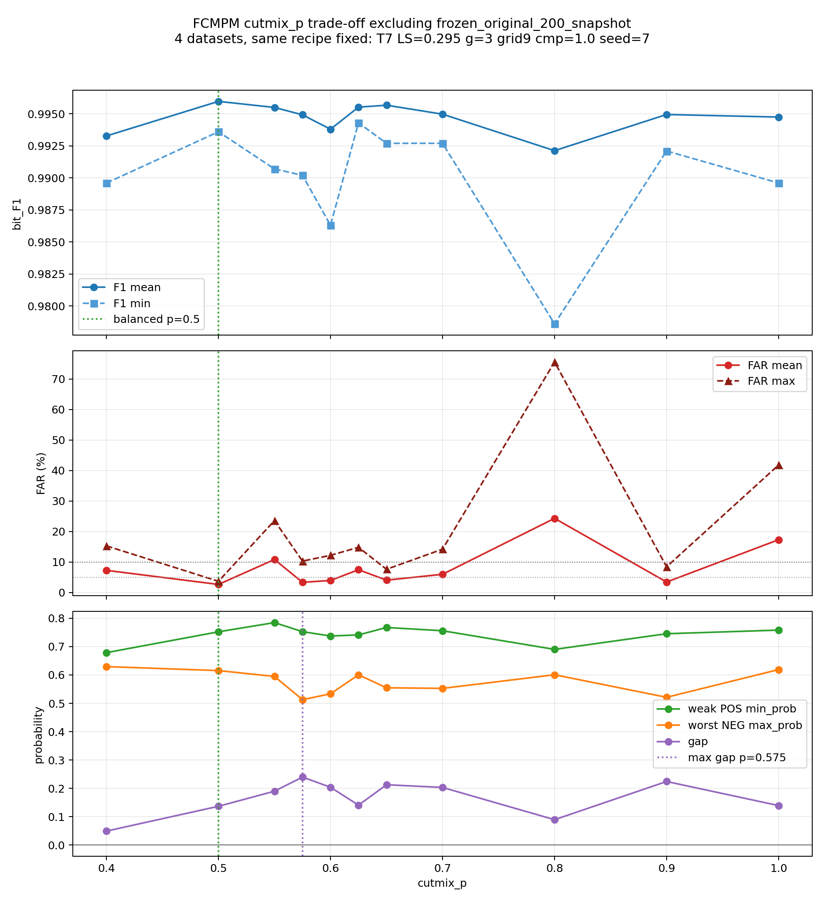

# FCMPM cutmix_p Trade-off excluding frozen_original_200_snapshot

Datasets used:
- `frozen_original`
- `sota_gapstress_seed31_260531`
- `sota_gapstress_seed97_260531`
- `frozen_original_2015_candidate`

Excluded dataset: `frozen_original_200_snapshot`

CSV: `FCMPM_CUTMIX_P_TRADEOFF_260608_no_snapshot.csv`

| p | n | F1 mean | F1 min | FAR mean | FAR max | posmin | negmax | gap |
|---:|---:|---:|---:|---:|---:|---:|---:|---:|
| 0.4000 | 4 | 0.9933 | 0.9896 | 7.28% | 15.29% | 0.679 | 0.629 | 0.049 |
| 0.5000 | 4 | 0.9960 | 0.9936 | 2.66% | 3.69% | 0.752 | 0.616 | 0.137 |
| 0.5500 | 4 | 0.9955 | 0.9907 | 10.83% | 23.57% | 0.785 | 0.595 | 0.190 |
| 0.5750 | 4 | 0.9949 | 0.9902 | 3.35% | 10.31% | 0.753 | 0.513 | 0.240 |
| 0.6000 | 4 | 0.9938 | 0.9863 | 3.96% | 12.19% | 0.738 | 0.533 | 0.204 |
| 0.6250 | 4 | 0.9955 | 0.9943 | 7.48% | 14.83% | 0.741 | 0.601 | 0.141 |
| 0.6500 | 4 | 0.9957 | 0.9927 | 4.06% | 7.62% | 0.767 | 0.555 | 0.213 |
| 0.7000 | 4 | 0.9950 | 0.9927 | 5.98% | 14.21% | 0.756 | 0.553 | 0.203 |
| 0.8000 | 4 | 0.9921 | 0.9786 | 24.32% | 75.56% | 0.690 | 0.601 | 0.089 |
| 0.9000 | 4 | 0.9950 | 0.9921 | 3.45% | 8.44% | 0.746 | 0.521 | 0.224 |
| 1.0000 | 4 | 0.9948 | 0.9896 | 17.31% | 41.80% | 0.758 | 0.619 | 0.139 |

Reading:

- Balanced candidate under FAR tail control: `p=0.5000`.
- Max probability gap: `p=0.5750`.
- `p=0.65` is the best high-F1/high-gap compromise among the mid-high p values, but `p=0.50` has lower FAR max.