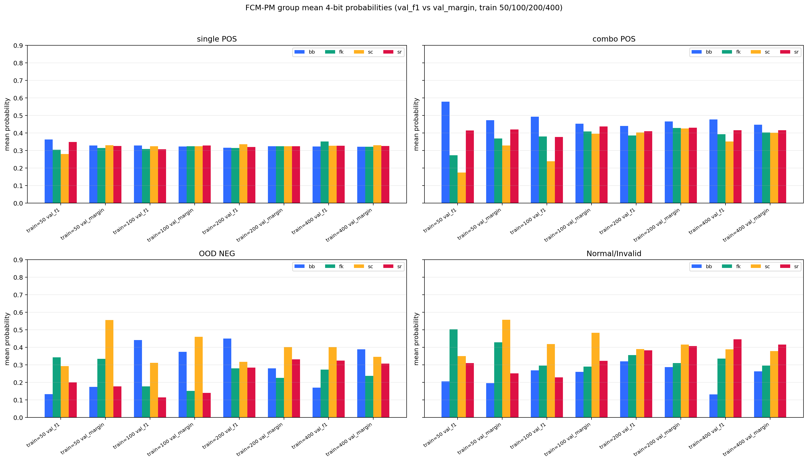
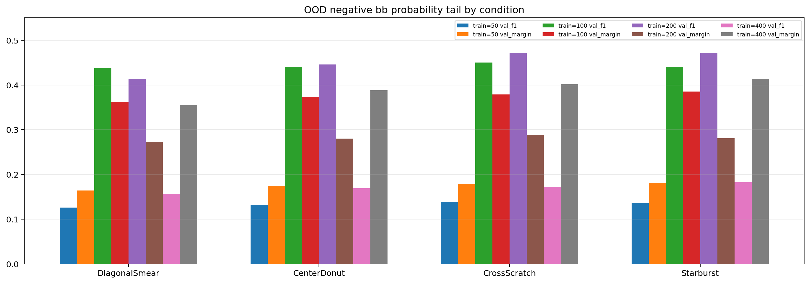
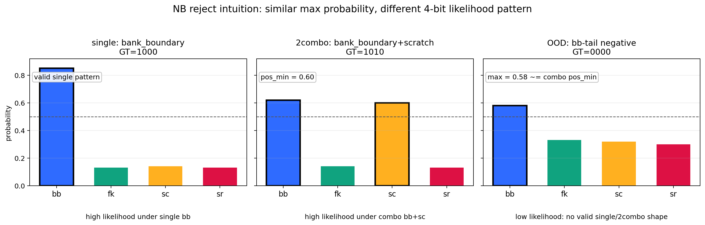

# FCM-PM Val Selection 관리자 보고서

작성일: 2026-06-03  
대상: chip multilabel defect classification  
목적: `val_f1` best model과 `val_margin` best model을 train/eval sample 수별로 비교하고, 관리자 보고용 대표 조건을 선정한다.

## 1. 결론

현재 matrix 기준 대표 조건은 다음이다.

| train/class | pick | eval/class | bit_F1 | pos_prob | neg_prob | gap | per-bit F1 (bb/fk/sc/sr) |
|---:|---|---:|---:|---:|---:|---:|---|
| 200 | val_margin | 20000 | 0.9958 | 0.7801 | 0.2292 | 0.5509 | 0.998 / 0.993 / 0.992 / 1.000 |

선정 이유:

- `val_f1` 기준은 validation F1이 빨리 포화되어 early checkpoint를 고르는 경향이 있다.
- `val_margin` 기준은 POS/NEG probability gap을 직접 키운 checkpoint를 고른다.
- train/class 200은 high bit_F1과 큰 probability gap이 동시에 유지된다.
- train/class 400은 POS 성능은 높지만 OOD negative class에서 `bank_boundary` tail이 올라가므로 현재 조건 그대로는 대표 조건으로 두지 않는다.

## 2. 고정 실험 조건

### Dataset

| 항목 | 경로 |
|---|---|
| train root | `E:/data/images/classification_chips_iter116J_orig814_260529` |
| validation root | `E:/data/images/chip_multilabel_v15direct_n2000` |
| eval root | `E:/data/images/eval_n20000` |

### Recipe

| 항목 | 값 |
|---|---|
| variant | `T7` |
| backbone | `convnextv2_base.fcmae_ft_in22k_in1k_384` |
| image size | `384` |
| epochs | `10` |
| batch / accum | `2 / 8` |
| learning rate | `1e-4` |
| label smoothing | `0.295` |
| seed | `7` |
| cutmix mode | `complement` |
| cutmix pair | `masked` |
| cutmix probability | `0.5` |
| FCM-PM group count | `3` |
| grid | `9x9` |
| complete label scale | `1.0` |
| A/B label | `0.90 / 1.00` |
| mask positive target | `0.65` |
| pair bias | `fork,scratch:2` |
| normal in train | excluded |

### Checkpoint Selection

| pick | 저장 파일 | 의미 |
|---|---|---|
| `val_f1` | `best_f1_model.pth` | validation bit F1 최대 epoch |
| `val_margin` | `best_model.pth` | validation POS/NEG probability gap 최대 epoch |

## 3. Train/Eval Matrix

관리자 보고용 matrix는 train/class 별로 분리한다. 각 train 조건마다 `val_f1` 3행, `val_margin` 3행으로 총 6row만 표시한다. 오탐률 컬럼은 제외하고, bit_F1과 probability separation 중심으로 표시한다.

### train/class = 50

| pick | eval/class | bit_F1 | pos_prob | neg_prob | gap | per-bit F1 (bb/fk/sc/sr) |
|---|---:|---:|---:|---:|---:|---|
| val_f1 | 200 | 0.7568 | 0.6120 | 0.2217 | 0.3903 | 0.956 / 0.662 / 0.499 / 0.909 |
| val_f1 | 2000 | 0.7533 | 0.6123 | 0.2214 | 0.3909 | 0.949 / 0.653 / 0.503 / 0.908 |
| val_f1 | 20000 | 0.7537 | 0.6128 | 0.2213 | 0.3915 | 0.949 / 0.646 / 0.511 / 0.909 |
| val_margin | 200 | 0.9132 | 0.7194 | 0.2297 | 0.4896 | 0.999 / 0.959 / 0.696 / 0.999 |
| val_margin | 2000 | 0.9167 | 0.7199 | 0.2299 | 0.4901 | 0.998 / 0.963 / 0.706 / 1.000 |
| val_margin | 20000 | 0.9163 | 0.7201 | 0.2300 | 0.4901 | 0.999 / 0.962 / 0.705 / 1.000 |

### train/class = 100

| pick | eval/class | bit_F1 | pos_prob | neg_prob | gap | per-bit F1 (bb/fk/sc/sr) |
|---|---:|---:|---:|---:|---:|---|
| val_f1 | 200 | 0.9521 | 0.6523 | 0.2121 | 0.4402 | 0.956 / 0.936 / 0.941 / 0.975 |
| val_f1 | 2000 | 0.9462 | 0.6521 | 0.2118 | 0.4403 | 0.941 / 0.945 / 0.933 / 0.966 |
| val_f1 | 20000 | 0.9445 | 0.6522 | 0.2120 | 0.4402 | 0.940 / 0.944 / 0.929 / 0.966 |
| val_margin | 200 | 0.9933 | 0.7674 | 0.2146 | 0.5528 | 0.996 / 0.998 / 0.979 / 1.000 |
| val_margin | 2000 | 0.9925 | 0.7671 | 0.2145 | 0.5526 | 0.997 / 0.995 / 0.979 / 0.999 |
| val_margin | 20000 | 0.9925 | 0.7671 | 0.2146 | 0.5524 | 0.997 / 0.994 / 0.980 / 1.000 |

### train/class = 200

| pick | eval/class | bit_F1 | pos_prob | neg_prob | gap | per-bit F1 (bb/fk/sc/sr) |
|---|---:|---:|---:|---:|---:|---|
| val_f1 | 200 | 0.9935 | 0.7468 | 0.2348 | 0.5119 | 0.993 / 0.993 / 0.989 / 0.999 |
| val_f1 | 2000 | 0.9926 | 0.7461 | 0.2343 | 0.5118 | 0.994 / 0.991 / 0.987 / 0.999 |
| val_f1 | 20000 | 0.9928 | 0.7463 | 0.2343 | 0.5119 | 0.994 / 0.990 / 0.988 / 1.000 |
| val_margin | 200 | 0.9971 | 0.7815 | 0.2293 | 0.5521 | 0.998 / 0.998 / 0.992 / 1.000 |
| val_margin | 2000 | 0.9959 | 0.7801 | 0.2291 | 0.5510 | 0.998 / 0.994 / 0.992 / 1.000 |
| val_margin | 20000 | 0.9958 | 0.7801 | 0.2292 | 0.5509 | 0.998 / 0.993 / 0.992 / 1.000 |

### train/class = 400

| pick | eval/class | bit_F1 | pos_prob | neg_prob | gap | per-bit F1 (bb/fk/sc/sr) |
|---|---:|---:|---:|---:|---:|---|
| val_f1 | 200 | 0.9705 | 0.7292 | 0.2239 | 0.5053 | 0.991 / 0.984 / 0.919 / 0.988 |
| val_f1 | 2000 | 0.9702 | 0.7287 | 0.2240 | 0.5047 | 0.988 / 0.984 / 0.921 / 0.988 |
| val_f1 | 20000 | 0.9710 | 0.7289 | 0.2239 | 0.5050 | 0.989 / 0.983 / 0.924 / 0.988 |
| val_margin | 200 | 0.9967 | 0.7590 | 0.2270 | 0.5320 | 0.991 / 0.996 / 0.999 / 1.000 |
| val_margin | 2000 | 0.9944 | 0.7580 | 0.2270 | 0.5310 | 0.989 / 0.992 / 0.997 / 1.000 |
| val_margin | 20000 | 0.9947 | 0.7580 | 0.2270 | 0.5310 | 0.990 / 0.992 / 0.997 / 1.000 |


## 4. Probability Pattern

차트 파일은 이미지 출력 절대규칙에 따라 `E:/data/images/` 아래에 저장했다.





### Group Mean Probability

| condition | group | bb | fk | sc | sr |
|---|---|---:|---:|---:|---:|
| train=50 val_f1 | single POS | 0.362 | 0.304 | 0.279 | 0.348 |
| train=50 val_f1 | combo POS | 0.578 | 0.273 | 0.174 | 0.414 |
| train=50 val_f1 | OOD NEG | 0.133 | 0.343 | 0.293 | 0.200 |
| train=50 val_f1 | Normal/Invalid | 0.206 | 0.503 | 0.351 | 0.311 |
| train=50 val_margin | single POS | 0.328 | 0.315 | 0.330 | 0.325 |
| train=50 val_margin | combo POS | 0.473 | 0.368 | 0.328 | 0.419 |
| train=50 val_margin | OOD NEG | 0.174 | 0.335 | 0.556 | 0.177 |
| train=50 val_margin | Normal/Invalid | 0.197 | 0.428 | 0.557 | 0.252 |
| train=100 val_f1 | single POS | 0.328 | 0.308 | 0.324 | 0.307 |
| train=100 val_f1 | combo POS | 0.493 | 0.379 | 0.239 | 0.377 |
| train=100 val_f1 | OOD NEG | 0.442 | 0.178 | 0.312 | 0.114 |
| train=100 val_f1 | Normal/Invalid | 0.269 | 0.296 | 0.419 | 0.230 |
| train=100 val_margin | single POS | 0.322 | 0.323 | 0.325 | 0.328 |
| train=100 val_margin | combo POS | 0.453 | 0.408 | 0.395 | 0.438 |
| train=100 val_margin | OOD NEG | 0.375 | 0.152 | 0.461 | 0.140 |
| train=100 val_margin | Normal/Invalid | 0.261 | 0.290 | 0.483 | 0.323 |
| train=200 val_f1 | single POS | 0.316 | 0.314 | 0.336 | 0.320 |
| train=200 val_f1 | combo POS | 0.439 | 0.385 | 0.402 | 0.410 |
| train=200 val_f1 | OOD NEG | 0.451 | 0.280 | 0.318 | 0.284 |
| train=200 val_f1 | Normal/Invalid | 0.321 | 0.356 | 0.391 | 0.383 |
| train=200 val_margin | single POS | 0.323 | 0.324 | 0.324 | 0.325 |
| train=200 val_margin | combo POS | 0.465 | 0.428 | 0.426 | 0.430 |
| train=200 val_margin | OOD NEG | 0.281 | 0.227 | 0.402 | 0.332 |
| train=200 val_margin | Normal/Invalid | 0.287 | 0.310 | 0.415 | 0.407 |
| train=400 val_f1 | single POS | 0.323 | 0.352 | 0.327 | 0.327 |
| train=400 val_f1 | combo POS | 0.477 | 0.392 | 0.351 | 0.415 |
| train=400 val_f1 | OOD NEG | 0.170 | 0.274 | 0.401 | 0.324 |
| train=400 val_f1 | Normal/Invalid | 0.132 | 0.336 | 0.390 | 0.447 |
| train=400 val_margin | single POS | 0.321 | 0.322 | 0.329 | 0.326 |
| train=400 val_margin | combo POS | 0.447 | 0.403 | 0.401 | 0.416 |
| train=400 val_margin | OOD NEG | 0.390 | 0.238 | 0.346 | 0.307 |
| train=400 val_margin | Normal/Invalid | 0.263 | 0.296 | 0.379 | 0.416 |

읽는 법:

- single POS는 자기 bit 하나만 높고 나머지는 낮은 구조지만, group mean으로 평균내면 네 bit가 비슷하게 보인다. class별 표에서 실제 one-hot 구조를 확인해야 한다.
- combo POS는 두 bit가 동시에 올라가야 하며, combo POS 평균이 낮으면 multi-label recall이 약해진다.
- OOD NEG와 Normal/Invalid는 모든 bit가 낮아야 한다. 특정 bit 평균이 올라가면 해당 bit tail이 생긴 것이다.
- train=400 val_margin은 combo POS는 강하지만 OOD NEG의 `bb` tail이 커진다. train=200 val_margin은 그 tail이 낮아 대표 조건으로 적합하다.

## 5. Class Probability Diagnostic

아래 표는 모든 train/class 조건과 두 checkpoint 선택 기준(`val_f1`, `val_margin`)을 동일하게 보여준다. POS는 single+combo, NEG는 Normal/Invalid/OOD이다.

### train=50 val_f1, eval=20000

| class | GT | bb | fk | sc | sr | metric |
|---|---|---:|---:|---:|---:|---|
| bank_boundary | 1000 | 0.862 | 0.140 | 0.106 | 0.209 | bit_F1=1.000 |
| fork | 100 | 0.188 | 0.839 | 0.094 | 0.144 | bit_F1=0.985 |
| scratch | 10 | 0.215 | 0.103 | 0.798 | 0.155 | bit_F1=1.000 |
| scratch_rot | 1 | 0.184 | 0.135 | 0.120 | 0.883 | bit_F1=1.000 |
| bank_boundary+fork | 1100 | 0.831 | 0.264 | 0.100 | 0.184 | bit_F1=0.503 |
| bank_boundary+scratch | 1010 | 0.839 | 0.144 | 0.145 | 0.173 | bit_F1=0.496 |
| bank_boundary+scratch_rot | 1001 | 0.745 | 0.118 | 0.120 | 0.510 | bit_F1=0.635 |
| fork+scratch | 110 | 0.535 | 0.519 | 0.242 | 0.116 | bit_F1=0.263 |
| fork+scratch_rot | 101 | 0.338 | 0.489 | 0.098 | 0.680 | bit_F1=0.654 |
| scratch+scratch_rot | 11 | 0.179 | 0.103 | 0.338 | 0.820 | bit_F1=0.652 |
| Normal | 0 | 0.127 | 0.520 | 0.361 | 0.195 | FAR=0.222 |
| Invalid | 0 | 0.285 | 0.486 | 0.340 | 0.427 | FAR=0.000 |
| DiagonalSmear | 0 | 0.126 | 0.348 | 0.289 | 0.196 | FAR=0.008 |
| CenterDonut | 0 | 0.132 | 0.343 | 0.292 | 0.200 | FAR=0.005 |
| CrossScratch | 0 | 0.139 | 0.348 | 0.292 | 0.201 | FAR=0.005 |
| Starburst | 0 | 0.136 | 0.333 | 0.300 | 0.203 | FAR=0.011 |

### train=50 val_margin, eval=20000

| class | GT | bb | fk | sc | sr | metric |
|---|---|---:|---:|---:|---:|---|
| bank_boundary | 1000 | 0.856 | 0.152 | 0.148 | 0.144 | bit_F1=1.000 |
| fork | 100 | 0.153 | 0.846 | 0.167 | 0.142 | bit_F1=0.998 |
| scratch | 10 | 0.163 | 0.123 | 0.849 | 0.145 | bit_F1=1.000 |
| scratch_rot | 1 | 0.141 | 0.137 | 0.155 | 0.868 | bit_F1=1.000 |
| bank_boundary+fork | 1100 | 0.743 | 0.565 | 0.110 | 0.114 | bit_F1=0.904 |
| bank_boundary+scratch | 1010 | 0.811 | 0.099 | 0.489 | 0.109 | bit_F1=0.583 |
| bank_boundary+scratch_rot | 1001 | 0.773 | 0.105 | 0.093 | 0.787 | bit_F1=0.998 |
| fork+scratch | 110 | 0.182 | 0.604 | 0.690 | 0.112 | bit_F1=0.895 |
| fork+scratch_rot | 101 | 0.162 | 0.735 | 0.074 | 0.656 | bit_F1=0.991 |
| scratch+scratch_rot | 11 | 0.167 | 0.102 | 0.510 | 0.739 | bit_F1=0.567 |
| Normal | 0 | 0.166 | 0.384 | 0.600 | 0.152 | FAR=0.099 |
| Invalid | 0 | 0.227 | 0.473 | 0.514 | 0.351 | FAR=0.000 |
| DiagonalSmear | 0 | 0.164 | 0.336 | 0.556 | 0.175 | FAR=0.029 |
| CenterDonut | 0 | 0.174 | 0.335 | 0.554 | 0.177 | FAR=0.025 |
| CrossScratch | 0 | 0.179 | 0.338 | 0.554 | 0.178 | FAR=0.030 |
| Starburst | 0 | 0.181 | 0.329 | 0.560 | 0.180 | FAR=0.037 |

### train=100 val_f1, eval=20000

| class | GT | bb | fk | sc | sr | metric |
|---|---|---:|---:|---:|---:|---|
| bank_boundary | 1000 | 0.845 | 0.124 | 0.175 | 0.128 | bit_F1=1.000 |
| fork | 100 | 0.159 | 0.839 | 0.135 | 0.119 | bit_F1=0.993 |
| scratch | 10 | 0.117 | 0.116 | 0.865 | 0.117 | bit_F1=1.000 |
| scratch_rot | 1 | 0.192 | 0.152 | 0.120 | 0.865 | bit_F1=1.000 |
| bank_boundary+fork | 1100 | 0.606 | 0.510 | 0.163 | 0.106 | bit_F1=0.663 |
| bank_boundary+scratch | 1010 | 0.741 | 0.149 | 0.366 | 0.097 | bit_F1=0.974 |
| bank_boundary+scratch_rot | 1001 | 0.839 | 0.112 | 0.123 | 0.591 | bit_F1=0.954 |
| fork+scratch | 110 | 0.165 | 0.694 | 0.412 | 0.107 | bit_F1=0.978 |
| fork+scratch_rot | 101 | 0.196 | 0.635 | 0.102 | 0.562 | bit_F1=0.865 |
| scratch+scratch_rot | 11 | 0.411 | 0.175 | 0.265 | 0.799 | bit_F1=0.911 |
| Normal | 0 | 0.247 | 0.220 | 0.389 | 0.074 | FAR=0.308 |
| Invalid | 0 | 0.292 | 0.372 | 0.449 | 0.385 | FAR=0.000 |
| DiagonalSmear | 0 | 0.437 | 0.174 | 0.309 | 0.113 | FAR=0.608 |
| CenterDonut | 0 | 0.441 | 0.176 | 0.310 | 0.114 | FAR=0.615 |
| CrossScratch | 0 | 0.450 | 0.180 | 0.308 | 0.112 | FAR=0.649 |
| Starburst | 0 | 0.441 | 0.183 | 0.321 | 0.117 | FAR=0.557 |

### train=100 val_margin, eval=20000

| class | GT | bb | fk | sc | sr | metric |
|---|---|---:|---:|---:|---:|---|
| bank_boundary | 1000 | 0.851 | 0.149 | 0.144 | 0.147 | bit_F1=1.000 |
| fork | 100 | 0.150 | 0.852 | 0.153 | 0.150 | bit_F1=0.995 |
| scratch | 10 | 0.143 | 0.145 | 0.852 | 0.153 | bit_F1=1.000 |
| scratch_rot | 1 | 0.146 | 0.148 | 0.149 | 0.862 | bit_F1=1.000 |
| bank_boundary+fork | 1100 | 0.764 | 0.698 | 0.092 | 0.124 | bit_F1=0.992 |
| bank_boundary+scratch | 1010 | 0.763 | 0.098 | 0.651 | 0.112 | bit_F1=0.935 |
| bank_boundary+scratch_rot | 1001 | 0.808 | 0.116 | 0.098 | 0.734 | bit_F1=0.998 |
| fork+scratch | 110 | 0.126 | 0.696 | 0.734 | 0.105 | bit_F1=0.989 |
| fork+scratch_rot | 101 | 0.129 | 0.761 | 0.101 | 0.778 | bit_F1=0.993 |
| scratch+scratch_rot | 11 | 0.126 | 0.078 | 0.696 | 0.772 | bit_F1=0.979 |
| Normal | 0 | 0.298 | 0.216 | 0.515 | 0.179 | FAR=0.001 |
| Invalid | 0 | 0.224 | 0.364 | 0.451 | 0.467 | FAR=0.000 |
| DiagonalSmear | 0 | 0.362 | 0.149 | 0.463 | 0.139 | FAR=0.027 |
| CenterDonut | 0 | 0.374 | 0.151 | 0.459 | 0.140 | FAR=0.032 |
| CrossScratch | 0 | 0.379 | 0.154 | 0.457 | 0.138 | FAR=0.044 |
| Starburst | 0 | 0.385 | 0.153 | 0.463 | 0.143 | FAR=0.052 |

### train=200 val_f1, eval=20000

| class | GT | bb | fk | sc | sr | metric |
|---|---|---:|---:|---:|---:|---|
| bank_boundary | 1000 | 0.843 | 0.155 | 0.162 | 0.146 | bit_F1=1.000 |
| fork | 100 | 0.140 | 0.831 | 0.143 | 0.149 | bit_F1=1.000 |
| scratch | 10 | 0.137 | 0.138 | 0.879 | 0.129 | bit_F1=1.000 |
| scratch_rot | 1 | 0.143 | 0.132 | 0.159 | 0.854 | bit_F1=1.000 |
| bank_boundary+fork | 1100 | 0.782 | 0.634 | 0.115 | 0.115 | bit_F1=0.981 |
| bank_boundary+scratch | 1010 | 0.747 | 0.095 | 0.615 | 0.107 | bit_F1=0.942 |
| bank_boundary+scratch_rot | 1001 | 0.765 | 0.111 | 0.130 | 0.709 | bit_F1=0.992 |
| fork+scratch | 110 | 0.107 | 0.650 | 0.717 | 0.087 | bit_F1=0.982 |
| fork+scratch_rot | 101 | 0.117 | 0.733 | 0.093 | 0.705 | bit_F1=0.992 |
| scratch+scratch_rot | 11 | 0.117 | 0.087 | 0.741 | 0.736 | bit_F1=0.997 |
| Normal | 0 | 0.346 | 0.297 | 0.407 | 0.299 | FAR=0.000 |
| Invalid | 0 | 0.296 | 0.415 | 0.375 | 0.467 | FAR=0.000 |
| DiagonalSmear | 0 | 0.413 | 0.283 | 0.326 | 0.291 | FAR=0.105 |
| CenterDonut | 0 | 0.446 | 0.281 | 0.321 | 0.284 | FAR=0.170 |
| CrossScratch | 0 | 0.472 | 0.280 | 0.316 | 0.274 | FAR=0.231 |
| Starburst | 0 | 0.472 | 0.277 | 0.307 | 0.289 | FAR=0.209 |

### train=200 val_margin, eval=20000

| class | GT | bb | fk | sc | sr | metric |
|---|---|---:|---:|---:|---:|---|
| bank_boundary | 1000 | 0.852 | 0.150 | 0.147 | 0.148 | bit_F1=1.000 |
| fork | 100 | 0.149 | 0.853 | 0.149 | 0.147 | bit_F1=1.000 |
| scratch | 10 | 0.147 | 0.147 | 0.853 | 0.148 | bit_F1=1.000 |
| scratch_rot | 1 | 0.146 | 0.146 | 0.145 | 0.855 | bit_F1=1.000 |
| bank_boundary+fork | 1100 | 0.791 | 0.702 | 0.115 | 0.123 | bit_F1=0.989 |
| bank_boundary+scratch | 1010 | 0.772 | 0.102 | 0.674 | 0.111 | bit_F1=0.968 |
| bank_boundary+scratch_rot | 1001 | 0.806 | 0.126 | 0.117 | 0.762 | bit_F1=0.998 |
| fork+scratch | 110 | 0.144 | 0.737 | 0.773 | 0.104 | bit_F1=0.988 |
| fork+scratch_rot | 101 | 0.143 | 0.793 | 0.101 | 0.749 | bit_F1=0.993 |
| scratch+scratch_rot | 11 | 0.136 | 0.106 | 0.775 | 0.733 | bit_F1=1.000 |
| Normal | 0 | 0.298 | 0.246 | 0.431 | 0.343 | FAR=0.000 |
| Invalid | 0 | 0.276 | 0.375 | 0.400 | 0.472 | FAR=0.000 |
| DiagonalSmear | 0 | 0.273 | 0.225 | 0.404 | 0.331 | FAR=0.001 |
| CenterDonut | 0 | 0.280 | 0.226 | 0.403 | 0.331 | FAR=0.002 |
| CrossScratch | 0 | 0.289 | 0.228 | 0.403 | 0.326 | FAR=0.007 |
| Starburst | 0 | 0.281 | 0.228 | 0.398 | 0.341 | FAR=0.007 |

### train=400 val_f1, eval=20000

| class | GT | bb | fk | sc | sr | metric |
|---|---|---:|---:|---:|---:|---|
| bank_boundary | 1000 | 0.859 | 0.150 | 0.156 | 0.149 | bit_F1=1.000 |
| fork | 100 | 0.149 | 0.898 | 0.133 | 0.150 | bit_F1=1.000 |
| scratch | 10 | 0.142 | 0.195 | 0.869 | 0.161 | bit_F1=1.000 |
| scratch_rot | 1 | 0.142 | 0.164 | 0.150 | 0.848 | bit_F1=1.000 |
| bank_boundary+fork | 1100 | 0.719 | 0.687 | 0.110 | 0.117 | bit_F1=0.984 |
| bank_boundary+scratch | 1010 | 0.801 | 0.117 | 0.482 | 0.111 | bit_F1=0.791 |
| bank_boundary+scratch_rot | 1001 | 0.692 | 0.104 | 0.130 | 0.717 | bit_F1=0.972 |
| fork+scratch | 110 | 0.320 | 0.688 | 0.664 | 0.088 | bit_F1=0.923 |
| fork+scratch_rot | 101 | 0.185 | 0.648 | 0.084 | 0.731 | bit_F1=0.976 |
| scratch+scratch_rot | 11 | 0.148 | 0.108 | 0.633 | 0.726 | bit_F1=0.938 |
| Normal | 0 | 0.104 | 0.305 | 0.380 | 0.341 | FAR=0.000 |
| Invalid | 0 | 0.159 | 0.367 | 0.399 | 0.552 | FAR=0.107 |
| DiagonalSmear | 0 | 0.156 | 0.275 | 0.401 | 0.323 | FAR=0.004 |
| CenterDonut | 0 | 0.169 | 0.274 | 0.401 | 0.324 | FAR=0.011 |
| CrossScratch | 0 | 0.172 | 0.275 | 0.400 | 0.323 | FAR=0.015 |
| Starburst | 0 | 0.183 | 0.272 | 0.403 | 0.327 | FAR=0.016 |

### train=400 val_margin, eval=20000

| class | GT | bb | fk | sc | sr | metric |
|---|---|---:|---:|---:|---:|---|
| bank_boundary | 1000 | 0.849 | 0.139 | 0.151 | 0.154 | bit_F1=1.000 |
| fork | 100 | 0.143 | 0.856 | 0.154 | 0.148 | bit_F1=1.000 |
| scratch | 10 | 0.143 | 0.147 | 0.859 | 0.147 | bit_F1=1.000 |
| scratch_rot | 1 | 0.149 | 0.145 | 0.152 | 0.855 | bit_F1=1.000 |
| bank_boundary+fork | 1100 | 0.765 | 0.746 | 0.110 | 0.132 | bit_F1=0.977 |
| bank_boundary+scratch | 1010 | 0.772 | 0.081 | 0.687 | 0.103 | bit_F1=0.985 |
| bank_boundary+scratch_rot | 1001 | 0.758 | 0.106 | 0.113 | 0.714 | bit_F1=0.979 |
| fork+scratch | 110 | 0.154 | 0.682 | 0.719 | 0.087 | bit_F1=0.983 |
| fork+scratch_rot | 101 | 0.115 | 0.720 | 0.090 | 0.736 | bit_F1=0.992 |
| scratch+scratch_rot | 11 | 0.119 | 0.080 | 0.689 | 0.722 | bit_F1=0.999 |
| Normal | 0 | 0.245 | 0.262 | 0.383 | 0.364 | FAR=0.000 |
| Invalid | 0 | 0.282 | 0.331 | 0.375 | 0.469 | FAR=0.010 |
| DiagonalSmear | 0 | 0.355 | 0.244 | 0.356 | 0.311 | FAR=0.052 |
| CenterDonut | 0 | 0.388 | 0.236 | 0.346 | 0.309 | FAR=0.090 |
| CrossScratch | 0 | 0.402 | 0.234 | 0.340 | 0.306 | FAR=0.116 |
| Starburst | 0 | 0.413 | 0.237 | 0.342 | 0.303 | FAR=0.118 |

## 6. NB Reject Sidecar

NB reject는 model 자체를 다시 학습하지 않고, 이미 나온 4-bit probability vector 위에 별도 reject rule을 붙이는 sidecar다.

사용한 완료 case:

| 항목 | 값 |
|---|---|
| recipe family | `samplecap_T7_LS02950_g3_grid9_cmp10000_p05000_ab090_100_mpos065_s7_ep10_tr200` |
| calibration preds | `E:/data/images/chip_multilabel_v15direct_n2000` 평가 preds |
| eval preds | `E:/data/images/eval_n20000` 평가 preds |
| NB model | GaussianNB on defect probability vectors |
| selected threshold | `pos-q=0.0001` |
| tau | `-40.935299` |

### NB 결과

| mode | reject-empty bit_F1 | accepted-only bit_F1 | false reject POS | false accept NEG | pos coverage | neg coverage |
|---|---:|---:|---:|---:|---:|---:|
| raw model | 0.9962 | 0.9962 | 0 | small nonzero | 1.0000 | 1.0000 |
| NB reject, pos-q=0.0001 | 0.9954 | 0.9965 | 282 | 0 | 0.9982 | 0.0000 |

해석:

- raw model은 모든 sample에 대해 그대로 예측한다.
- NB reject는 probability vector가 defect class distribution과 충분히 닮은 경우만 accept한다.
- rejected sample은 empty prediction으로 바꾼다.
- accepted-only 기준 bit_F1은 `0.9962 -> 0.9965`로 소폭 상승한다.
- false accept NEG가 `0`이 되어 negative leakage를 제거한다.
- 대신 POS 282개가 reject되므로, reject-empty bit_F1은 `0.9954`로 약간 낮아진다.

즉 NB reject는 classifier 자체를 더 정확하게 만든다기보다, ambiguous probability vector를 운영상 reject로 보내서 accepted region의 신뢰도를 높이는 장치다.

### Threshold selection protocol

NB reject threshold는 eval/test 결과를 보고 맞추면 안 된다. train과 final eval 사이에 별도 calibration split을 두고, 그 split에서 한 번 고정한 뒤 final eval에는 그대로 적용한다.

정의:

```text
s(x) = max_c log P(p(x) | class=c)
     = known single/2combo 10개 class 중 가장 높은 NB log-likelihood

accept if s(x) >= tau
reject otherwise
```

calibration set에서 score를 두 그룹으로 나눈다.

```text
pos_scores = scores of known defect classes
             = single 4 + 2combo 6

neg_scores = scores of negative / unknown-like classes
             = Normal + Invalid + OOD proxies
```

운영 목표는 두 개다.

```text
target_neg_accept = allowed fraction of NEG accepted as known defect
max_pos_reject    = allowed fraction of POS rejected
```

accept 조건이 `s(x) >= tau`이므로 threshold 후보는 다음처럼 잡는다.

```text
tau_neg(alpha) = empirical quantile(neg_scores, 1 - alpha)
tau_pos(beta)  = empirical quantile(pos_scores, beta)
```

예:

```text
alpha = 0.001  # NEG 0.1% 이하만 accept
beta  = 0.005  # POS 0.5% 이하만 reject

tau_neg = quantile(neg_scores, 0.999)
tau_pos = quantile(pos_scores, 0.005)
```

판정:

```text
if tau_neg <= tau_pos:
    feasible separation
    choose tau between tau_neg and tau_pos
else:
    POS/NEG score distributions overlap
    one threshold cannot satisfy both constraints
```

운영 안전을 우선하면:

```text
tau = tau_neg
```

이 경우 negative leakage는 줄지만 POS false reject가 늘 수 있다.

POS recall을 우선하면:

```text
tau = tau_pos
```

이 경우 POS reject는 줄지만 negative accept가 늘 수 있다.

`target_neg_accept=0`을 요구하면 다음과 같다.

```text
tau = max(neg_scores) + eps
```

이것이 `neg-max` 방식이다. calibration negative를 전부 reject하도록 고정한다. 논문/관리자 보고에서는 이 값을 최종 eval에 그대로 적용하고, 아래 네 값을 같이 보고해야 한다.

| metric | meaning |
|---|---|
| POS coverage | POS 중 reject되지 않고 accept된 비율 |
| POS false reject | POS인데 reject된 수/비율 |
| NEG coverage | NEG 중 accept된 비율 |
| NEG false accept | NEG인데 known defect로 통과한 수/비율 |

현재 report의 `pos-q=0.0001`은 POS coverage를 거의 1로 유지하려는 threshold다. safety-first 운영안을 보려면 `neg-max`도 같이 표시해야 한다. 두 threshold는 목적이 다르므로 한 표에 같이 보고한다.

학술 근거:

| reference | threshold 관점 | 이 보고서에서의 대응 |
|---|---|---|
| Chow (1970), optimum recognition error-reject tradeoff | reject는 error cost와 reject cost의 tradeoff로 결정한다 | `target_neg_accept`와 `max_pos_reject`를 운영 비용으로 둔다 |
| El-Yaniv & Wiener (2010), selective classification | coverage를 낮추면 accepted risk를 낮출 수 있고 risk-coverage curve로 본다 | NB reject는 coverage를 낮춰 accepted-only quality를 올리는 sidecar다 |
| Geifman & El-Yaniv (2017), selective classification for DNNs | validation/calibration에서 confidence threshold를 골라 risk target을 맞춘다 | `tau`는 eval이 아니라 calibration scores에서 고정한다 |
| Hendrycks & Gimpel (2017), OOD/misclassification baseline | confidence score threshold로 misclassified/OOD를 분리한다 | raw max-prob 대신 NB log-likelihood score를 confidence로 쓴다 |
| Lee et al. (2018), Mahalanobis/Gaussian OOD score | class-conditional Gaussian score와 threshold detector를 사용한다 | 4-bit probability vector 위의 diagonal GaussianNB score를 사용한다 |
| Conformal / reject-option calibration papers | calibration quantile로 coverage/error target을 정한다 | `tau_pos`, `tau_neg`를 empirical quantile로 고정한다 |

참고 링크:

- Chow, C. K. (1970), "On optimum recognition error and reject tradeoff", IEEE Transactions on Information Theory. https://research.ibm.com/publications/on-optimum-recognition-error-and-reject-tradeoff
- El-Yaniv, R. and Wiener, Y. (2010), "On the Foundations of Noise-free Selective Classification", JMLR. https://jmlr.csail.mit.edu/papers/v11/el-yaniv10a.html
- Geifman, Y. and El-Yaniv, R. (2017), "Selective Classification for Deep Neural Networks", NeurIPS. https://papers.neurips.cc/paper/7073-selective-classification-for-deep-neural-networks.pdf
- Hendrycks, D. and Gimpel, K. (2017), "A Baseline for Detecting Misclassified and Out-of-Distribution Examples in Neural Networks", ICLR. https://arxiv.org/abs/1610.02136
- Lee, K. et al. (2018), "A Simple Unified Framework for Detecting Out-of-Distribution Samples and Adversarial Attacks", NeurIPS. https://papers.nips.cc/paper/2018/hash/abdeb6f575ac5c6676b747bca8d09cc2-Abstract.html
- Garcia-Galindo, C. et al. (2024), "Multi-class Classification with Reject Option and Performance Guarantees using Conformal Prediction", PMLR. https://proceedings.mlr.press/v230/garcia-galindo24a.html

## 7. NB Reject의 실제 의미: max-prob가 아니라 4-bit pattern likelihood

NB reject를 붙이는 이유는 raw classifier의 bit_F1을 크게 올리기 위해서가 아니다. 핵심은 **어떤 OOD sample에서 특정 bit probability가 높아도, 그 4개 확률의 전체 모양은 single 또는 2-combo defect와 다르다**는 점을 이용하는 것이다.

아래 그림은 설명용 예시다. 실제 측정값 그대로가 아니라, **OOD max**와 **2-combo pos_min**이 거의 같은 상황을 만든다.
이렇게 해도 4-bit pattern이 다르면 NB reject가 구분할 수 있음을 보여준다.



| pattern | GT | bb | fk | sc | sr |
|---|---|---:|---:|---:|---:|
| single bb | 1000 | 0.85 | 0.13 | 0.14 | 0.13 |
| 2combo bb+sc | 1010 | 0.62 | 0.14 | 0.60 | 0.13 |
| OOD bb-tail | 0000 | 0.58 | 0.33 | 0.32 | 0.30 |

해석:

- single bb: `bb`만 높고 나머지는 낮다.
- 2combo bb+sc: `bb=0.62`, `sc=0.60`으로 두 target bit가 같이 높다.
- OOD bb-tail: `bb=0.58`로 2combo의 `pos_min=0.60`과 비슷하지만, `fk/sc/sr`가 모두 중간값이라 valid single/2combo 모양이 아니다.

단순 threshold 관점에서는 OOD의 `bb=0.58`이 커 보인다. 2combo의 작은 positive인 `sc=0.60`과 거의 비슷하기 때문이다. 그래서 max-prob 또는 bit별 threshold만 보면 OOD와 2combo가 헷갈릴 수 있다.

하지만 4-bit pattern은 다르다.

- single `bank_boundary`: `bb`만 높고 `fk/sc/sr`는 낮아야 한다.
- 2combo `bank_boundary+scratch`: `bb`와 `sc`가 동시에 높고 `fk/sr`는 낮아야 한다.
- OOD bb-tail: `bb`는 높지만 `fk/sc/sr`가 모두 애매한 중간값이다. single도 아니고, `bb+scratch` 2combo도 아니다.

즉 NB reject가 보는 것은 "`bb`가 0.58인가?"가 아니라, "`[bb, fk, sc, sr] = [0.58, 0.33, 0.32, 0.30]`가 어떤 valid class distribution처럼 생겼는가?"이다.

### Example likelihood calculation

아래는 위 illustration 값을 그대로 class mean으로 둔 계산이 아니다. 그 방식이면 sample과 mean이 같아져 `z2_sum=0`이 나오는데, 실제 NB reject 설명으로는 부적절하다.

실제 계산은 다음처럼 한다.

- `x`: 현재 sample의 4-bit probability vector
- `mu_c`: calibration set에서 class `c`의 4-bit probability 평균
- `sigma_c`: calibration set에서 class `c`의 4-bit probability 표준편차
- 비교 대상: known defect class `single 4개 + 2combo 6개`

여기서는 train=200 val_margin run의 calibration predictions로 GaussianNB를 다시 fit한 값을 사용한다.

```text
calib_preds = outputs/frozen_iter116J_orig814_v15direct_n2000/
              samplecap_T7_LS02950_g3_grid9_cmp10000_p05000_ab090_100_mpos065_s7_ep10_tr200_ev00200/
              eval_best/eval_260531_231711/preds_chip.parquet

cell = T0__I10
tau  = -165.22   # calibration negative max 기준
```

NB class likelihood는 bit별 Gaussian likelihood를 곱한 것과 같고, log domain에서는 다음처럼 더한다.

```text
z2_sum_c = sum_j ((x_j - mu_cj) / sigma_cj)^2
logL_c   = log prior_c + sum_j log Normal(x_j ; mu_cj, sigma_cj^2)
score    = max_c logL_c
```

중요한 점은 `mu`만 보는 것이 아니라 `sigma`까지 들어간다는 것이다. 분산이 작은 bit에서 조금만 벗어나도 likelihood가 크게 떨어진다.

### Case A: 2combo-like sample `x=[0.62, 0.14, 0.60, 0.13]`

이 sample은 `bb`와 `sc`가 같이 높은 2combo-like vector다. 실제 calibration distribution 10개와 비교하면 다음과 같다.

```text
sample x = [0.62, 0.14, 0.60, 0.13]

rank  class                     mu=[bb,fk,sc,sr]          sigma=[bb,fk,sc,sr]       z2_sum   logL
----  ------------------------  ------------------------  ------------------------  -------  ---------
1     bank_boundary+scratch     [0.769,0.103,0.674,0.110] [0.034,0.014,0.086,0.008]    34.42      -8.21
2     fork+scratch              [0.137,0.751,0.774,0.103] [0.041,0.055,0.035,0.011]   293.70    -138.84
3     fork+scratch_rot          [0.141,0.787,0.103,0.754] [0.016,0.091,0.011,0.035]  3189.37   -1586.29
4     bank_boundary+fork        [0.794,0.697,0.115,0.122] [0.027,0.115,0.008,0.008]  3442.98   -1712.04
5     scratch+scratch_rot       [0.132,0.106,0.779,0.729] [0.009,0.005,0.039,0.040]  3550.86   -1764.97
6     bank_boundary+scratch_rot [0.808,0.125,0.115,0.758] [0.023,0.004,0.006,0.035]  6242.63   -3109.60
7     fork                      [0.151,0.853,0.150,0.148] [0.013,0.008,0.015,0.004] 10019.10   -4996.79
8     scratch                   [0.147,0.148,0.853,0.148] [0.004,0.008,0.007,0.005] 14430.89   -7200.76
9     bank_boundary             [0.853,0.150,0.147,0.148] [0.004,0.003,0.003,0.003] 27965.91  -13965.70
10    scratch_rot               [0.146,0.146,0.145,0.854] [0.004,0.004,0.006,0.005] 45281.49  -22625.00
```

중간 계산 예:

```text
x                  = [0.620, 0.140, 0.600, 0.130]
mu_bank+scratch    = [0.769, 0.103, 0.674, 0.110]
sigma              = [0.034, 0.014, 0.086, 0.008]
diff               = [-0.149, +0.037, -0.074, +0.020]
z^2                = [19.45, 7.55, 0.75, 6.67]
z2_sum             = 34.42
logL               = -8.21
```

`score=-8.21`이고 `tau=-165.22`보다 높으므로 이 sample은 known 2combo로 accept된다. 반대로 single `bank_boundary`와 비교하면 `sc`가 너무 높아서 멀어진다.

```text
x            = [0.620, 0.140, 0.600, 0.130]
mu_single_bb = [0.853, 0.150, 0.147, 0.148]
sigma        = [0.004, 0.003, 0.003, 0.003]
z2_sum       = 27965.91
logL         = -13965.70
```

### Case B: OOD sample `x=[0.58, 0.33, 0.32, 0.30]`

이 값은 `bb=0.58`이라 max-prob만 보면 2combo의 positive 값과 비슷하다. 그러나 10개 known class와 비교하면 모든 likelihood가 낮다.

```text
sample x = [0.58, 0.33, 0.32, 0.30]

rank  class                     mu=[bb,fk,sc,sr]          sigma=[bb,fk,sc,sr]       z2_sum   logL
----  ------------------------  ------------------------  ------------------------  -------  ---------
1     fork+scratch              [0.137,0.751,0.774,0.103] [0.041,0.055,0.035,0.011]   685.51    -334.74
2     bank_boundary+scratch     [0.769,0.103,0.674,0.110] [0.034,0.014,0.086,0.008]   901.11    -441.56
3     bank_boundary+fork        [0.794,0.697,0.115,0.122] [0.027,0.115,0.008,0.008]  1224.73    -602.91
4     fork+scratch_rot          [0.141,0.787,0.103,0.754] [0.016,0.091,0.011,0.035]  1339.02    -661.11
5     bank_boundary+scratch_rot [0.808,0.125,0.115,0.758] [0.023,0.004,0.006,0.035]  3858.41   -1917.49
6     scratch+scratch_rot       [0.132,0.106,0.779,0.729] [0.009,0.005,0.039,0.040]  4685.07   -2332.07
7     fork                      [0.151,0.853,0.150,0.148] [0.013,0.008,0.015,0.004]  6559.47   -3266.97
8     bank_boundary             [0.853,0.150,0.147,0.148] [0.004,0.003,0.003,0.003] 16167.25   -8066.37
9     scratch                   [0.147,0.148,0.853,0.148] [0.004,0.008,0.007,0.005] 18979.45   -9475.04
10    scratch_rot               [0.146,0.146,0.145,0.854] [0.004,0.004,0.006,0.005] 30482.21  -15225.36
```

nearest는 `fork+scratch`지만, score가 `-334.74`로 `tau=-165.22`보다 낮다. 따라서 reject/OOD로 보낸다. nearest class 이름이 직관과 다를 수 있는 이유는 NB가 max bit 하나가 아니라 4차원 전체와 각 bit의 variance를 같이 보기 때문이다.

중간 계산 예:

```text
x               = [0.580, 0.330, 0.320, 0.300]
mu_fork+scratch = [0.137, 0.751, 0.774, 0.103]
sigma           = [0.041, 0.055, 0.035, 0.011]
diff            = [+0.443, -0.421, -0.454, +0.197]
z^2             = [118.83, 57.60, 168.56, 340.52]
z2_sum          = 685.51
logL            = -334.74
```

`bb`가 높아도 `fork+scratch`의 `fk/sc` high pattern에도 안 맞고, `bank_boundary+scratch`의 `bb/sc` high pattern에도 충분히 안 맞는다. 그래서 known class 중 가장 가까운 후보가 있어도 likelihood threshold를 넘지 못하면 reject된다.

### Decision rule

질문한 것처럼 "둘 다 값이 너무 낮으면 OOD로 가는가?"에 대한 답은 yes다. 정확히는 explicit OOD class로 분류한다기보다 **known single/2combo likelihood가 전부 threshold보다 낮으면 reject**한다.

```text
score = max_c logL_c(x)

if score >= tau:
    accept nearest known class
else:
    reject as unknown/OOD/ambiguous
```

요약:

| sample | best known class | best logL | decision |
|---|---|---:|---|
| 2combo-like `[0.62,0.14,0.60,0.13]` | bank_boundary+scratch | -8.21 | accept |
| OOD bb-tail `[0.58,0.33,0.32,0.30]` | fork+scratch nearest | -334.74 | reject/OOD |

핵심은 OOD의 `bb=0.58`이 높아 보여도, 전체 vector가 어떤 single/2combo Gaussian distribution에도 충분히 들어가지 않는다는 점이다. 그래서 max-prob는 애매해도 likelihood score는 낮아지고 reject된다.

GaussianNB는 이 차이를 다음처럼 본다.

```text
p = [p_bb, p_fk, p_sc, p_sr]

For each defect class c:
  L_c(p) = log P(p | c)
         = sum_j log Normal(p_j ; mu_{c,j}, sigma^2_{c,j})

score(p) = max_c L_c(p)

accept if score(p) >= tau
reject otherwise
```

여기서 중요한 점은 `max(p)`만 보는 것이 아니라 `[p_bb, p_fk, p_sc, p_sr]` 전체를 class별 Gaussian 분포에 넣는다는 것이다. 그래서 `bb` 하나가 높아도 나머지 bit 조합이 class distribution과 안 맞으면 likelihood가 낮아진다.

정리하면:

- max-prob threshold: "`bb`가 높으니 positive일 수 있다"까지만 본다.
- NB reject: "`bb`가 높긴 한데, 이 4-bit vector가 `bank_boundary` single 또는 `bank_boundary+X` combo처럼 생겼는가?"를 본다.
- 따라서 NB reject는 **bit threshold 보정**이 아니라 **probability-shape reject**다.

주의:

- NB reject는 raw model 학습 성능을 대체하지 않는다.
- raw 성능표와 NB-reject 성능표는 분리해서 제시해야 한다.
- 운영상 의미는 "불확실한 OOD/ambiguous vector를 reject하고 accepted region의 신뢰도를 높이는 것"이다.

## 8. 후속 실험

train/class 400을 살리려면 현재 조건을 그대로 유지하기보다 positive expansion을 줄이는 방향이 맞다.

| priority | change | reason |
|---:|---|---|
| 1 | `cmp=1.0 -> 0.7 or 0.8` | synthetic combo target을 완화해 OOD tail 상승 억제 |
| 2 | `cutmix_p=0.5 -> 0.25 or 0.35` | FCMPM 노출 비율을 낮춰 over-expansion 완화 |
| 3 | `A/B label=0.90/1.00 -> 0.85/1.00 or 0.90/0.95` | 강한 source와 약한 source의 target balance 조정 |
| 4 | checkpoint criterion에 OOD negative tail penalty 추가 | `val_margin`만으로는 OOD tail을 직접 보지 못함 |

## 9. 관리자용 요약

이번 실험에서 확인한 내용은 다음이다.

- `val_margin` checkpoint selection은 `val_f1` selection보다 probability separation이 좋다.
- 대표 조건은 `train=200 / val_margin / eval=20000`이다.
- train=400은 POS bit_F1은 높지만 OOD 쪽 `bb` tail이 올라가므로 현재 조건에서는 대표 조건으로 두지 않는다.
- NB reject는 ambiguous probability vector를 reject해 accepted region의 품질을 높인다.
- NB reject는 raw model 성능과 별도로 운영용 safety layer로 보고해야 한다.

최종 보고 기준:

| 목적 | 조건 |
|---|---|
| raw model 대표 성능 | `train=200 / val_margin / eval=20000` |
| 운영 safety layer | GaussianNB reject sidecar |
| 다음 개선 방향 | train=400에서 `cmp`, `cutmix_p`, A/B label 완화 |
