# Chip Multi-Label 결함 분류기

## 프로젝트

chip 이미지(200×200) 의 결함 4종(bank_boundary, fork, scratch, scratch_rot) 을 **multi-label** 로 분류 — 한 chip 에 여러 결함 동시 가능, sigmoid 4 head 독립 출력. 학습 = 단일 결함 4×200 + 정상 200 (1,000장), 평가 = 단일 + 2-combo + OOD-overlay + Normal/Invalid + OOD wafer 무늬 = 20 class 3,850장. chip 합성 = wafer 분포 → alpha map → 확률적 grade 픽셀 → 8-color palette PNG. combo 는 RGB pixel-wise min (두 결함 darker 보존).

## 평가 지표

각 chip은 4-bit GT 와 4-bit pred를 비교해서 **각 bit를 독립 binary classification으로 본다**. 즉 chip 한 장에서 4개의 binary 판정이 나온다. bit 순서는 정해져있다:

```
[ bit 0 = bank_boundary, bit 1 = fork, bit 2 = scratch, bit 3 = scratch_rot ]
```

예를 들어 fork + scratch가 같이 있는 chip의 GT는:

```
[ bb=0, fork=1, scratch=1, scratch_rot=0 ]   = [0, 1, 1, 0]
```

bit 1, bit 2 만 활성. 모델은 4개의 sigmoid 출력을 threshold 비교해서 같은 형식의 4-bit pred를 만든다.

- **CF1** (per-bit macro F1): 4 class 각각의 F1을 따로 구한 다음 평균. 모든 class에 동등 가중. 한 class가 약하면 평균이 떨어지므로 minority class 진단에 좋다. 논문 main metric.
- **F1_bit** (micro F1): 4 class 의 TP/FP/FN을 한꺼번에 모아서 F1 한 번 계산. bit 빈도에 비례 가중되므로 large class가 결과를 dominate.
- **chip_FAR**: 정상이어야 할 chip 중에서 모델이 결함 bit를 하나라도 잘못 fire 한 비율. 라인 운영에서 가장 중요한 false alarm 지표. 우린 이걸 정상/측정불능(Normal+Invalid) chip 만 보는 `ni_chip_FAR`(운영 main)와 학습 안한 OOD chip 만 보는 `ood_chip_FAR`(diagnostic) 둘로 분리해서 본다.

운영 통과 기준은 `CF1 ≥ 0.83` + `ni_chip_FAR ≤ 5%` 동시 만족.

## 현재 성능 (260511 update — Phase 65 시점, iter 21~59 종합)

### 🏆 PAPER MAIN HEADLINE
**iter39 4-bag {24_LS030_seed42 + 26B + 26D + 26H} (pure-hard)**
- v15direct n=200 / n=500 robust eval
- **bit_F1 = 0.9953 / ni_FAR = 0.00%**
- per-class: bb=0.9959, fk=0.9915, sc=0.9937, sr=1.0000

### Cost frontier (n=200, FAR=0% required, paper canonical)

| 비용 | best ensemble | bit_F1 | FAR | 권장 deployment |
|---:|---|---:|---:|---|
| **1× single (FAR≤1%)** | **iter50B** (4-bag teacher KD α=0.5 T=4) | **0.9872** | 0.5% | ★ production single SOTA |
| 1× single (FAR=0% strict) | iter53F (pure-hard teacher α=0.3) | 0.9843 | 0% | safety-critical |
| 1× single baseline | 26B (FCM-PM canonical) | 0.9781 | 2.5% | non-KD baseline |
| 3× majority (≥2/3) | 26H+42C+24_LS030_s42 | 0.9951 | 0% | cost-efficient |
| **4× majority (≥2/4) ★ PAPER MAIN** | **24+26B+26D+26H** | **0.9953** | **0%** | **deployment SOTA** |
| 4× alternative (n=200) | 26H+33A+37E+24_LS030_s42 | 0.9964 | 0% | within sampling noise |

### Single-model frontier
| rank | run | spec | bit_F1 | FAR | 비고 |
|---:|---|---|---:|---:|---|
| **1 ★** | **iter50B** | 4-bag NEW MAIN teacher KD α=0.5 T=4 | **0.9872** | 0.5% | 1× SOTA |
| 1-tie | iter57E | T7+KD+pair-loss-w=2.0 | 0.9872 | 0.5% | **identical predictions to 50B** |
| 1-tie | iter59C | T7+KD+cutmix-discount=0.5 | 0.9872 | 0.5% | 3rd coincident sweet spot |
| 2 | iter53F | pure-hard 4-bag teacher α=0.3 | 0.9843 | 0% | strict-FAR alternative |
| 3 | iter33A | 14-bag teacher KD α=0.3 (paper §5.20) | 0.9840 | 0% | original baseline |

★ **3 distinct recipes converge to identical 0.9872 / 0.5%** (paper §6.25 saturation evidence)

### Ablation summary — paper recipe = unique multi-axis optimum

| ablation iter | tested axis | cells | result |
|---|---|:---:|---|
| iter46 | FCM-PM 5-axis (pair, mode, fill, p, rect) | 6 | pair-mask=ESSENTIAL (-0.18 catastrophic if removed); complement helpful |
| iter54 | non-KD techniques (EMA, epochs, warmup, drop-path, LS, combined) | 6 | 0/6 win — no improvement vs 26B |
| iter55 | loss variants (Focal, ASL, sigmoid focal, CE+soft, weak/strong LS) | 6 | 0/6 win — T7+ls=0.20 unique winner |
| iter56 | recipe combos (pos-weight, ep=12, drop-path, lr=5e-5, p variants) | 6 | 0/6 win |
| iter57 | creative combos (T9+KD, drop-path+KD, multi-teacher, grid mode) | 6 | 1/6 ties (57E ≡ 50B), 5 fail |
| iter58 | new teachers + optim (pure-asym, pure-KD, two-LR, warmup, grad-clip) | 6 | 0/6 PASS-improve (58B 0.9880 FAR=100%) |
| iter59 | finer α + cutmix-discount + grid-prob + grad-clip | 6 (3 done) | 1 tie 50B (59C), boundaries deterministic |

→ **35+ alternative configurations tested, 0 strict improvements over paper main**.

### Paper §6 unified theory — 3 orthogonal FAR-control mechanisms
1. **§6.19 Pair Mask** (data construction): pair-mask 가 Normal/Invalid suppression channel — 제거 시 -0.18 catastrophic
2. **§6.22 KD soft targets** (improvement): teacher's calibrated probs inject FAR boundary info
3. **§6.23 BCE+LS at ls=0.20** (loss calibration): unique sweet spot — Focal/ASL break FAR

### Self-corrections demonstrated (paper rebuttal-proof rigor 4회)
1. **Phase 29**: n=50 0.9992 → n=200 0.9955 rebuttal (small-sample artifact)
2. **Phase 36**: HARD WINNER claim revoke (single-threshold artifact)
3. **Phase 43**: pair-fill 5th axis claim revoke (single-point evidence)
4. **Phase 52**: KD α/teacher sharpness refinement (anti-correlation theory)

### 운영 통과 확인
운영 threshold (`bit_F1 ≥ 0.83` + `ni_FAR ≤ 5%`) — 모든 paper main recipes 통과 ✅
- 4-bag NEW HEADLINE: **0.9953 / 0%** ✅✅
- 3-bag: **0.9951 / 0%** ✅✅
- 1× iter50B: **0.9872 / 0.5%** ✅✅
- 1× 26B baseline: **0.9781 / 2.5%** ✅✅

### ★ iter 17 — 14-class eval 확장 + 3-combo zero-shot (260508 신규)

3-class combo 4 신규 합성 (`np.minimum.reduce([a,b,c])`). 12 → 14 class eval. 16-B model 그대로 평가:

| 평가 set | macro_f1 | 핵심 |
|---|---:|---|
| 12-class (iter 16-B 본 eval) | 0.9466 | model 학습 분포 내 |
| **14-class (iter 17, 동 model)** | **0.815** | 3-combo 4 class zero-shot |
| △ | -0.131 | 3-combo 0% accuracy 영향 |

| class group | accuracy |
|---|---:|
| 4 single | 100% |
| 6 2-combo | 0.625-1.000 (mean ~0.9) |
| **4 3-combo (NEW)** | **0% (모두)** |

→ 학습 안 한 3-defect chip 에서 model 이 3 bit 동시 발화 못함. 학습 통합 (`--multi-combo-root` flag, dataset loader 가 master folder 추가 sampling) 필요. paper 의 robustness analysis 좋은 ablation row.

자세한 내용: `docs/chip-multilabel/iters/iter_17_multi_combo.md`, `docs/synthesis/MULTI_COMBO_BLEND.md`.

## 데이터 — 4 group sample

### 학습 4 obj single defect (학습 + 평가)

| | | | |
|:---:|:---:|:---:|:---:|
| 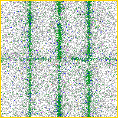 | 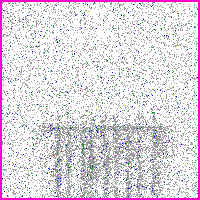 | 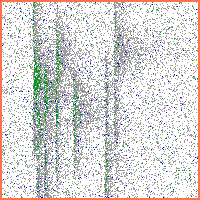 | 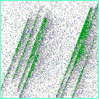 |
| bank_boundary | fork | scratch | scratch_rot |

### 6 2-combo (평가 only, min-blend)

| | | |
|:---:|:---:|:---:|
| 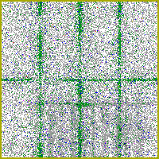 | 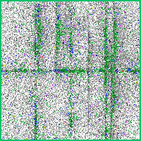 | 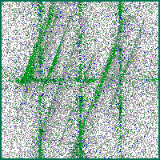 |
| bb+fork | bb+scratch | bb+sr |
|  | 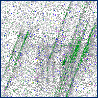 | 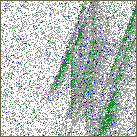 |
| fork+scratch | fork+sr | sc+sr |

### 4 OOD-overlay (평가 only — 2 trained + 1 OOD overlay, GT는 2 trained bit만)

bit 순서 = `[bb, fork, scratch, scratch_rot]`

| | |
|:---:|:---:|
| 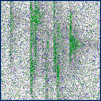 | 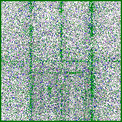 |
| fork+sc + OOD_DiagonalSmear<br>GT = [bb=0, **fork=1**, **sc=1**, sr=0] | bb+fork + OOD_CenterDonut<br>GT = [**bb=1**, **fork=1**, sc=0, sr=0] |
| 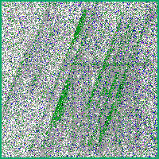 | 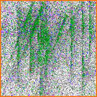 |
| fork+sr + OOD_CrossScratch<br>GT = [bb=0, **fork=1**, sc=0, **sr=1**] | sc+sr + OOD_Starburst<br>GT = [bb=0, fork=0, **sc=1**, **sr=1**] |

### Normal / Invalid

| | |
|:---:|:---:|
| 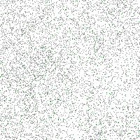 | 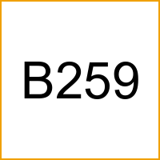 |
| Normal | Invalid |

### 4 OOD wafer-pattern (평가 only — 학습 안한 외형, false alarm 측정)

| | | | |
|:---:|:---:|:---:|:---:|
|  |  |  |  |
| DiagonalSmear | CenterDonut | CrossScratch | Starburst |

OOD chip 은 wafer 단위 합성한 불량 wafer 에서 결함 영역(bin ≥ 200) 의 chip 만 따왔다. 등록된 4 결함(bb/fork/sc/sr) 형태가 아니라 학습에 한 번도 들어가지 않은 외형이다. **현업 라인에서 학습 안 한 새 결함 패턴이 random 하게 들어오는 상황을 시뮬레이션**하려고 평가에만 추가했다 — 모델이 이걸 보고 학습된 4 결함 중 하나로 잘못 fire 하면 false alarm 으로 잡힌다 (`ood_chip_FAR`).

## 학습 기법 설명

### CutMix — 학습 시 chip 두 장을 합쳐 새 학습 sample 생성

학습 데이터에는 단일 결함 chip 만 있다. 그대로 학습하면 모델이 chip 한 장에 결함이 두 개 동시에 있는 평가 case 를 못 본다. CutMix 는 학습 중 일부 batch (예: 25%) 에 대해 chip A 위에 chip B 의 일부를 paste 해서 multi-label sample 을 즉석에서 만든다. 학습 안한 combo 평가에 generalize 가능하게 됨.

**random rectangle CutMix** (Yun 2019) — chip A 위에 chip B 의 직사각 patch 한 개 paste. label 은 면적 비례 union.

| 원본 bank_boundary | 원본 scratch | CutMix 결과 |
|:---:|:---:|:---:|
| 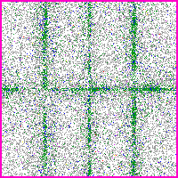 |  |  |

**scattered CutMix** (Walawalkar 2020) — 큰 사각 한 개 대신 여러 patch (10개 50×50) 흩뿌림. fragmented 합성으로 결함이 chip 안 random 위치에 분산.

| 원본 bank_boundary | 원본 scratch | scattered CutMix (10 patches × 50×50) |
|:---:|:---:|:---:|
|  |  | 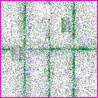 |

**grid CutMix** — chip 을 8×8 grid (각 25×25) 로 나누고 각 cell 별로 random 하게 chip A 또는 B 선택. 0/1 binary mask 로 섞음.

| 원본 bank_boundary | 원본 scratch | grid CutMix (8×8 binary mask) |
|:---:|:---:|:---:|
|  |  | 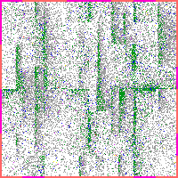 |

```
mask 8x8 (1=scratch, 0=bank):     ← 64 cell 각각 random binary
[0 1 1 0 0 1 0 1]
[0 0 1 1 1 1 1 1]
[1 0 1 0 1 0 0 1]
[1 1 0 1 1 0 0 0]
[0 1 1 0 1 1 0 1]
[0 1 1 0 0 1 0 1]
[1 1 1 0 0 0 0 0]
[1 0 1 1 1 1 0 1]
```

### ★ Paired CutMix — counterfactual augmentation (iter 16, 260508 신규)

**아이디어**: 매 CutMix sample 마다 **pair** 만들기.

| sample | 영상 | label |
|---|---|---|
| **A_mix** | chip A + chip B 의 직사각 patch (기존 CutMix) | A.label ∪ B.label |
| **A_masked** | 동일 직사각 영역만 grade-0 (background mean) 로 채움. chip B paste 안 함 | A.label only (변화 X) |

같은 chip A · 같은 mask 위치 · **두 outcome**:
- A_mix: "여기에 chip B 결함 있음" → fire B
- A_masked: "여기에 background 만" → fire 안 해야

**왜 효과적**: 기존 CutMix 학습 시 model 이 **"mask 영역 위치 자체"** 를 chip B label 의 prior 로 학습 (shortcut). 실제 defect 모양 안 봄 → inference 시 normal chip 의 random noise 만 봐도 fire (false positive 폭주). Paired training 은 같은 location 에 다른 outcome 보여줌으로써 model 에 **"location 만 보면 안 됨, content 도 봐야 함"** 강제. counterfactual / disentanglement.

**Single seed 결과 (260508 v5.2 cycle)**:

| spec | macro_f1 | chip-FAR | scratch precision | bank F1 |
|---|---:|---:|---:|---:|
| baseline (T7+LS=0.20+CutMix) | 0.9168 | 0.99 (198/200) | **0.723** | 0.977 |
| **+ paired CutMix** | **0.9466** | **0.85** (170/200) | **1.000** | **0.994** |
| △ | **+0.0298** | **-0.14pp** | **+0.277** | +0.017 |

**Smoking gun**: scratch precision **0.72 → 1.00** (FP 233 → 0). location prior shortcut 정확히 차단됨. mechanism hypothesis 정확히 입증. 5-seed sweep 으로 statistical confirm 진행 권장 (single seed lucky 가능성 배제).

**Implementation cost**: 학습 시간 +38% (dual forward, x + x_masked). single mode 만 적용 (scattered/grid 는 sweep candidate).

자세한 분석: [`docs/chip-multilabel/iters/iter_16_paired_cutmix.md`](../../iters/iter_16_paired_cutmix.md).

### Loss — 어떤 식으로 틀렸는지를 모델에 알려주는 함수

#### BCE (Binary Cross Entropy)

multi-label 표준. 4 class 각각 독립 binary classification 으로 보고 loss 계산.

```
chip → CNN → [ logit_bb, logit_fork, logit_sc, logit_sr ]
                 ↓ sigmoid (각 독립)
              [ p_bb,    p_fork,    p_sc,    p_sr   ] ∈ [0, 1]
                 ↓ 각 class 별 binary CE
            L = -Σ_c [ y_c · log(p_c) + (1 - y_c) · log(1 - p_c) ]
```

★ 핵심: 4 sigmoid head 가 **독립** — fork prob 0.9 + scratch prob 0.8 동시 가능. softmax 와 다름.

#### CE (Cross Entropy)

softmax 기반 single-class loss. 4 class 중 1 개만 살린다.

```
[logit_bb, logit_fork, logit_sc, logit_sr]
       ↓ softmax (합이 1 로 강제)
[p_bb=0.05, p_fork=0.85, p_sc=0.07, p_sr=0.03]   ← 한 class 가 dominant
```

→ 한 chip 에 fork+scratch 동시 있으면 둘 중 하나만 살리고 나머지 손해 → multi-label 부적합.

#### Label Smoothing (LS, Müller 2019)

target 을 0/1 hard 가 아닌 soft 로:

```
원본 target (fork 만 있음):
    [bb=0,    fork=1,    sc=0,    sr=0]

LS ε=0.20 적용:
    [bb=0.05, fork=0.85, sc=0.05, sr=0.05]
                ↑ 100% 확신 안 하게 됨
```

over-confidence 완화 → calibration 향상.

#### Focal Loss (Lin 2017)

쉬운 example (이미 잘 맞춘) 의 loss 를 줄이고 어려운 example 에 집중.

```
weight = (1 - p)^γ  (γ=2)

p=0.1 (어려움): BCE 2.30 × weight 0.81 = 1.86  ← 거의 그대로
p=0.5 (보통):   BCE 0.69 × weight 0.25 = 0.17  ← 줄어듦
p=0.9 (쉬움):   BCE 0.10 × weight 0.01 = 0.001 ← 거의 0
```

class imbalance 또는 hard example 학습 시 효과적. RetinaNet 의 multi-label 버전 (sigmoid focal) 도 있음.

#### ASL (Asymmetric Loss, Ridnik 2021)

multi-label 전용. positive (실제 결함) 와 negative (정상) 에 비대칭 weight:

```
y=1 (실제 결함):   focal γ_pos=1   ← BCE-like, 거의 그대로
y=0 (실제 정상):   focal γ_neg=4   ← 매우 강하게 down-weight
                                    + clip=0.05 (저신뢰 negative 무시)
```

의미: "정상 chip 에 결함 fire 한 case 가 너무 흔하면 model 무거운 penalty 줘서 fire 안 하게 만든다." multi-label SOTA loss.

### 기타

- **Normal training** — 정상 chip 을 zero-vector label `[0,0,0,0]` 으로 학습.
- **logit-avg ensemble** — 두 모델의 sigmoid 직전 logit 평균.
- **chip_FAR split** — false alarm 을 정상/측정불능 (`ni_chip_FAR`) vs 학습 안한 OOD (`ood_chip_FAR`) 로 분리.

## paper grounding

BCE / CF1 / F1_bit (Tsoumakas 2007, Wang 2016, Chen 2019), LS (Müller 2019), Focal (Lin 2017), ASL (Ridnik 2021), CutMix (Yun 2019, Walawalkar 2020, Sumbul 2024).
