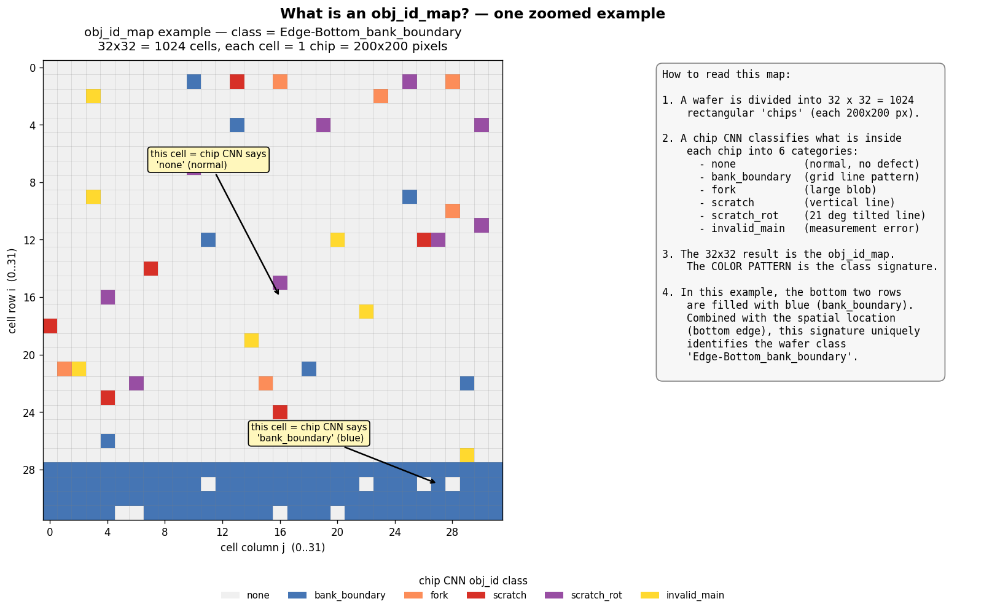
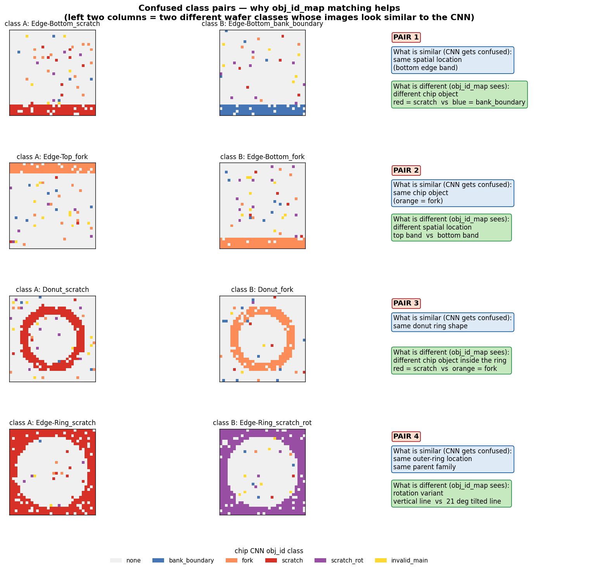
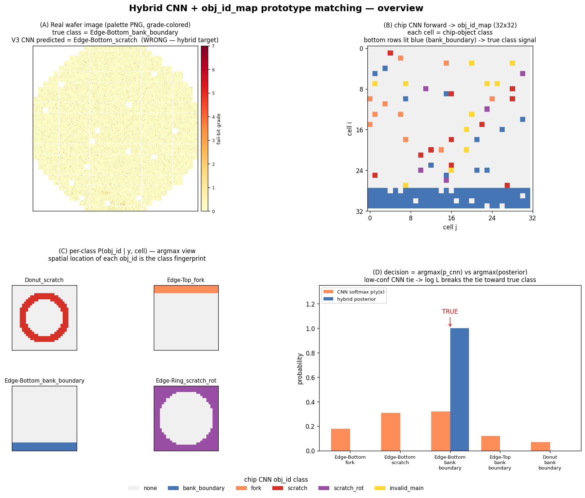
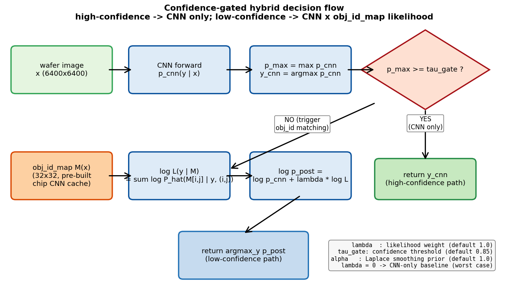
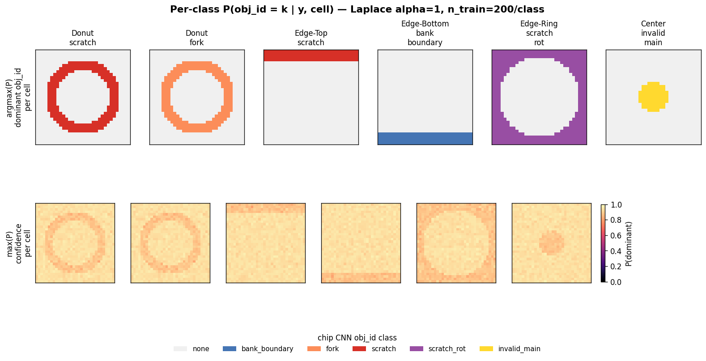
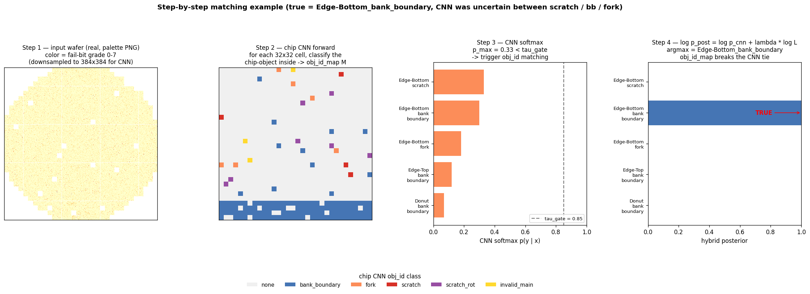

# 02 — Method

> **APPEND-ONLY.** 이 파일은 누적 기록. 한 번 적힌 row/section 절대 삭제·수정 금지.

## 1. Data synthesis

### 1.1 Wafer-level distribution heatmap (8 종)

WM-811K cca/* 의 224×224 RGBA mask (값 = {0=outside, 128=normal, 255=defect}) 를 입력으로
8 클래스 (Center / Donut / Edge-Loc / Edge-Ring / Loc / Near-full / Random + Thick-Edge)
별로 wafer-fitting → 32×32 / 256×256 두 해상도의 P(defect | cell) heatmap 학습 (출처:
`docs/image-generation/PIPELINE.md` line 7-22).

```
acc_defect[cell] / acc_wafer[cell]   (cell P(wafer 안) ≥ 0.10 만 유효)
→ _dist_heatmaps/<Class>_p_defect_{32,256}.npy/.png    (gitignored 산출물)
```

부재 시 재생성 명령: `python dist_learn/_dist_learn.py` (출처: `CLAUDE.md` line 48).

### 1.2 Chip-internal alpha 매커니즘

각 chip 내부 200×200 픽셀에 대해 spatial alpha field α(y, x) ∈ [0, 1] 를 정의. baseline
grade dist 와 object peak dist 의 cumulative threshold 위 mix:

```
P(grade=g | chip=defect, position=(x,y)) = (1-α(x,y))·BASELINE[g] + α(x,y)·OBJECT_DIST[g]

cum_mixed = (1-α[..., None])·CUM_BASE + α[..., None]·cum_obj
u = rng.random((CHIP, CHIP))
grades = (u[..., None] < cum_mixed).argmax(axis=-1)
```

(출처: `docs/image-generation/SPEC.md` §5)

baseline (정상 chip / object 영역 밖):
```python
BASELINE = [0.83, 0.15, 0.012, 0.005, 0.002, 0.0008, 0.0001, 0.0001]   # P(0..7)
# P(0) = 0.83, P(0)+P(1) = 0.98 (정상 chip 압도적 grade 0/1)
```

5 chip-object α 함수 (출처: `docs/image-generation/SPEC.md` §6):
- **bank_boundary**: 3 vertical (x=50/100/150) + 1 horizontal (y=100) Gaussian line, σ=10
- **fork** (이전 `particle_blast`, round 26): 단일 Gaussian blob, σ ∈ [22, 35]
- **scratch**: 2-5 random vertical line, σ ∈ [3.0, 5.0], length partial
- **scratch_rot** (이전 `scratch_21deg`, round 26): 21° 회전 line, 동일 분포
- **invalid_main**: chip 전체 palette idx 31 (white) — α 적용 X

### 1.3 9 wafer-canvas pattern (`_sample_canvas_gen.py`, round 12-25)

obj-active 18 class 와 별도로 obj-less 9 class 를 chip-internal alpha 매커니즘 wafer
6400×6400 한 번에 적용 (출처: `docs/image-generation/CANVAS_9.md`):

| Class | spatial pattern | peak alpha |
|---|---|---|
| DiagonalSmear | 1 line, 45°±5°, along-fade | U(0.30, 0.50) |
| CrossScratch | 2 ⊥ line cross | U(0.30, 0.50) |
| CrescentArc | bottom-fixed 1/4-1/3 arc | U(0.30, 0.50) |
| ParallelScratches | 3-5 parallel line | U(0.30, 0.50) |
| BrokenRing | annular ring × 1-3 angular gap | U(0.30, 0.50) |
| RingDots | ring 위 14-23 angular dot | U(0.40, 0.60) |
| CenterDonut | center 얇은 ring | U(0.30, 0.50) |
| Row | direct PIL Draw line (Y-locked, 짧은 mini-line) | binary 1.0 |
| Starburst | center 빈 ring + 8-14 radial ray | center 0.60-0.85 |

핵심 alpha 분포 함수 — Lorentzian sharp + heavy tail sum (출처:
`docs/image-generation/CANVAS_9.md` §1.2):

```python
sharp = 1.0 / (1.0 + (d/(0.5σ))**2)   # 좁고 매우 sharp peak
wide  = 0.60 / (1.0 + (d/(5σ))**2)     # 크고 넓은 heavy tail
return min(sharp + wide, 1.0)
```

| d | 0 | σ | 2σ | 4σ | 8σ | 15σ | 25σ |
|---|---|---|---|---|---|---|---|
| α | 1.00 | 0.78 | 0.58 | 0.40 | 0.18 | 0.06 | 0.024 |

Gaussian 단일 / 단일 Lorentzian 모두 round 18-20 시도 후 사용자 reject (양 끝 자연 fade
실패). 두 Lorentzian sum 만이 "가운데 매우 sharp + 양 끝 자연 0 fade" 동시 만족.

### 1.4 chip border decision (round 23 strict primary filter)

```python
chip_alpha_mean = chip_alpha[200x200].mean()
chip_alpha_max  = chip_alpha[200x200].max()
if chip_alpha_mean < 0.10: continue       # primary filter (line 직접 통과 chip 만)
if chip_alpha_max  < 0.30: continue       # secondary
p_def = min(chip_alpha_mean * 3.0, 1.0)
```

기존 max-only filter 시 line 곁가지 chip 까지 BIN → 외곽 산만. **alpha mean primary
가 line 직접 통과 chip 만 BIN, 그 외 모두 normal** (출처:
`docs/image-generation/CANVAS_9.md` §1.3, `feedback_canvas_alpha_design.md`).

### 1.5 invalid 비례 fix (round 25)

기존 `n=15 fixed` invalid_inside_mask → defect 갯수의 ~15% 비례:

```python
invalid_inside_mask = select_random_invalid(rng, defect_mask, inside,
                                            n=max(2, int(defect_mask.sum() * 0.15)))
```

defect 적은 class 의 invalid 도 적게 (출처: `docs/image-generation/CANVAS_9.md` §1.4,
`_sample_gen.py`).

### 1.6 출력 위치

```
PNG : D:/project/data/wm-811k/unknown/<class>/*.png       (6400×6400 palette)
JSON: D:/project/data/positions/unknown/<class>/*.json    (chip BIN + FTN/QTN + partid/pgm)
chip crop : D:/project/data/wm-811k/classification_chips/<obj>/<basename>_x<x>_y<y>_b<bin>.png
            (5 obj label, wafer generation 시점에 inline 저장 — `_sample_gen.save_chip_crops`)
```

## 2. Architecture — 3-stage chain

```
┌──────────────────────────┐    ┌──────────────────────────┐    ┌──────────────────────────┐
│ Stage 1: chip 5-class    │    │ Stage 2: obj_id_maps     │    │ Stage 3: compound        │
│ cnn_train_chip.py        │ →  │ chip_tools/_build_obj_id │ →  │ cnn_train_compound.py    │
│ data: 200×200 chip crop  │    │ _maps.py                  │    │ R = failbit, G = obj_id  │
│ logs_chip/, 5 class      │    │ wafer 마다 32×32 obj_id  │    │ B = zero, 3-channel      │
│                           │    │ .npy cache               │    │ logs_compound/, 33-class │
│ ConvNeXtV2-base 88M       │    │ chip CNN forward inline  │    │ ConvNeXtV2-base 88M      │
└──────────────────────────┘    └──────────────────────────┘    └──────────────────────────┘
                                                                          ↑
                                  비교 base ────  ┌──────────────────────────┐
                                                  │ wafer-only (R 만)         │
                                                  │ cnn_train_wafer.py       │
                                                  │ logs_wafer/, 33-class    │
                                                  └──────────────────────────┘
```

(출처: `CLAUDE.md` line 117-160, `.claude/agents/orch-master.md`,
`.claude/agents/stage3-compound.md`)

### 2.1 백본 정책

`models/convnextv2_base.fcmae_ft_in22k_in1k_384.pth` (ImageNet FCMAE pretrained
ConvNeXtV2-base, 88M). 모든 trainer 의 init backbone. local-only — `cnn_train.py` 가
자동 로드 (출처: `CLAUDE.md` line 157-159).

### 2.2 학습 핵심 옵션 (출처: `cnn_train.py` engine + 각 wrapper config)

- **EMA**: decay 0.95, warmup 3 epoch (출처: `cnn_train_chip.py` hparams.yaml)
- **Label smoothing**: 0.02
- **bf16 AMP** (output: `amp: true`)
- **Stochastic depth**: 0.05
- **Gradient clip**: 0.5
- **class_weight**: effective (Cui et al. CVPR 2019, β=0.999)
- **Loss**: cross-entropy 기본 (focal_gamma=2.0 옵션)

### 2.3 Block expand policy (categorical resize)

obj_id (32×32 categorical) / one-hot binary / probability 등 categorical map 의 spatial
resize 는 **`_chipgrid_resize.block_expand_2d` 만 사용** (출처:
`feedback_block_expand_only.md`, `CLAUDE.md` line 273-298):

```python
# ✅ 올바른 사용
from _chipgrid_resize import block_expand_2d
obj_384 = block_expand_2d(obj_32, 384, 384)            # 정수 12 px/cell
obj_200 = block_expand_2d(obj_32, 200, 200)            # 6 px/cell + 8 cell 7px (균등 spread)

# ❌ 금지 — categorical 신호 깨짐
PIL.Image.fromarray(obj_32).resize((384, 384), Image.BICUBIC)
F.interpolate(obj_t, size=(384, 384), mode='nearest')   # 정수 배수 가정
```

이 정책이 V3 chipgrid (val_f1 0.9946) 의 enabling factor 였고, compound BICUBIC 384
ceiling 0.9784 대비 +75% error 감소를 만든 단일 변경이다.

## 3. Optimizer / LR (★ AD reference, round 28 update)

### 3.1 round 28 LR 변경 사항

`D:/project/anomaly-detection/train.py` line 1497-1530 (참조: AD repo) 의 spec 을
known-cnn 의 3 trainer 모두 적용 (출처: 사용자 round 28 명시 + AD `docs/summary.md`):

| 항목 | 이전 (round 27 이하) | 새 (round 28) | 이유 |
|---|---|---|---|
| `lr_backbone` | 1e-5 | **2e-5** | AD 검증값, fine-tune 더 적극적 |
| `lr_head` | 1e-3 | **2e-4** | head 도 backbone 과 비례 (10×) — gradient spike 회피 |
| `warmup_epochs` | 2 | **5** | 충분한 warmup 으로 초기 LR spike 완화 |
| `LinearLR start_factor` | 0.1 | **0.05** | 매우 낮은 시작값. AD seed 4 spike 사례 fix |
| Main scheduler | CosineAnnealingLR (동일) | CosineAnnealingLR `eta_min=1e-6` | 동일 유지 |

AD `train.py:1503-1506` 의 주석:
> `# warmup start_factor 0.05 — 매우 낮은 시작값으로 gradient spike 방지`
> `# 기존 0.1은 초기 LR이 너무 높아 seed 4 같은 경우에 ep 4-8에서 spike 발생`

### 3.2 새 LR spec (3 trainer 모두 동일)

```python
optimizer = torch.optim.AdamW([
    {"params": backbone_params, "lr": 2e-5},
    {"params": head_params,     "lr": 2e-4},
], weight_decay=0.05)

warmup = LinearLR(optimizer, start_factor=0.05, total_iters=5)
cosine = CosineAnnealingLR(optimizer, T_max=epochs - 5, eta_min=1e-6)
scheduler = SequentialLR(optimizer, schedulers=[warmup, cosine], milestones=[5])
```

### 3.3 적용 trainer

- `cnn_train_chip.py` (Stage 1)
- `cnn_train_wafer.py` (R-only base)
- `cnn_train_compound.py` (Stage 3)

(출처: round 28 사용자 명시 — `cnn-master` agent dispatch 시 자동 적용 spec)

## 4. Multi-label ablation (8-stage paper-style)

본 single-label trained 모델을 multi-label 추론에 활용하는 8 stage ablation (출처:
`docs/multi-label/STAGES.md`, `docs/multi-label/README.md`).

| Stage | 역할 | Status |
|---|---|---|
| 1. 분포 학습 | 5 method × 33 class × 5 data-amount surface sweep | ✅ 완료 (`_dist_learn_per_class.py`, 850 npy + 37 plot, commit 687448b) |
| 2. Hyperparameter | class_weight / label_smoothing / loss 영향 측정 | ⏳ TODO |
| 3. `unknown_multi/` 합성 | 1000-3000 wafer 에 known multi-label GT | ⏳ TODO |
| 4. 추론 path 비교 | Phase A heuristic / Phase B AdaGC / Phase C BCE/ASL | ⏳ TODO |
| 5. Threshold tuning | per-class F1 sweep + Temp + IDF + top-K floor mix | ⏳ TODO |
| 6. Chip-Wafer matching | heatmap + GMM ensemble + CRF | ⏳ TODO |
| 7. Prod predict 보강 | best 조합을 `cnn_predict_compound_prod.py` 통합 | ⏳ TODO |
| 8. Master comparison | paper-style table + figure | ⏳ TODO |

### 4.1 ★ 사용자 우선순위 3 영역 (출처: `feedback_multi_label_priority.md`)

> "loss 부분과 chip class 로 wafer class matching 하는 부분이 이론과 여러 기법 mix 등
>  굉장히 중요해 보인다 관건이다. 그리고 multi-label 판정 방식도."

1. **Loss design** (deep-dive `docs/multi-label/LOSS_DESIGN.md`) — M1-M7 mix combinations
   (CE / Focal / BCE / ASL / AdaGC + label_smoothing + class_weight)
2. **Chip-Wafer matching** (deep-dive `docs/multi-label/MATCHING_DESIGN.md`) — C1-C7
   (heatmap / GMM / KDE / hybrid + CRF + Mahalanobis + consistency)
3. **Multi-label decision rule** (deep-dive `docs/multi-label/DECISION_RULE.md`) —
   D1-D8 (per-class F1 + Temp + IDF + top-K floor)

단일 기법 SOTA 비교 X. **mix 조합 sweep 이 본 ablation 의 진짜 contribution**.

## 5. Active class policy

### 5.1 33 → 20 active + 14 archive (round 11 결정)

V3 chipgrid (val_f1 0.9946) 의 saturated 분류 결과 기반 (출처:
`docs/wafer-ensemble/ACTIVE_CLASSES.md`, `feedback_active_class_policy.md`):

| Group | Count | Classes |
|---|---|---|
| Donut × 5 obj | 5 | Donut_{bank_boundary, invalid_main, fork, scratch, scratch_rot} |
| Edge-Bottom × 5 obj ★ weak | 5 | Edge-Bottom_{...} |
| Edge-Ring × 4 obj | 4 | Edge-Ring_{bank_boundary, fork, scratch, scratch_rot} (-invalid_main) |
| Edge-Top × 5 obj ★ weak | 5 | Edge-Top_{...} |
| 특수 | 1 | Thick-Edge_invalid_main |
| **Total active 20** | **20** | (`experiments/active_classes_20.yaml`) |

### 5.2 active 27 (canvas 9 추가)

active 20 + 9 wafer-canvas - 2 archive (Center_invalid_main, Full_invalid_main) =
**27** (`experiments/active_classes_27.yaml`).

### 5.3 active 30 (target)

8 obj-less wafer-canvas 새 class 합성 후 사용 target (현재 9 canvas 합성 완료 →
`experiments/active_classes_30.yaml` = `configs/chipgrid_class30_target.yaml`).

### 5.4 현재 (round 28)

`unknown/` 안 모든 class 사용 — 43 active class (Normal_bank_boundary 1000 sample,
다른 42 class 200 sample). 이는 `--active-classes-yaml` 미지정 시 default behavior.

archive 14 class 데이터 = `D:/project/data/wm-811k/unknown_archive/<class>/` copy 보존
(원본 unknown/ 도 그대로 — 무단 삭제 금지).

## Cross-link

- 데이터 합성 spec → `docs/image-generation/{SPEC,PIPELINE,CANVAS_9}.md`
- 3-stage chain → `.claude/agents/stage3-compound.md`, `CLAUDE.md` Quickstart
- block_expand 정책 → `feedback_block_expand_only.md`
- LR AD reference → `D:/project/anomaly-detection/train.py:1497-1530`,
  `D:/project/anomaly-detection/docs/summary.md`
- multi-label → `docs/multi-label/{README,STAGES,LOSS_DESIGN,MATCHING_DESIGN,DECISION_RULE}.md`
- active class → `docs/wafer-ensemble/ACTIVE_CLASSES.md`

## 6. Hybrid CNN + obj_id_map prototype matching (proposed, round 29)

> **상태**: 제안 (proposal, 미실험). 사용자 round 29 발화 (2026-05-14):
> *"can 으로 prob 낮은것만 obj맵으로 만들고 class별 obj 맵 분포를 만들고 maximum
>  likelihood 로 가장 가까운거 찾아나가는데 threshold로 어느값이상 올라가지 않으면
>  그냥 cnn 결과 뱉고 값이 좀 나오면 obj map으로 매칭 어떤가"*

### 6.1 Motivation

V3 chipgrid (val_f1 0.9946, 출처: `project_v3_chipgrid_best.md`) 는 33-class wafer
분류에서 saturated plateau 이며, compound BICUBIC 384 ceiling (test_f1 0.9784, 출처:
`docs/wafer-ensemble/DISCOVERY.md`) 은 오히려 R-only 대비 낮다. 본 제안은 **새 compound
trainer 학습 없이** V3 의 remaining error case (val 54 건) 를 후처리 refine 하는
**2-stage confidence-gated hybrid 추론 path**.

핵심 아이디어:
- CNN max_prob 가 높으면 (high confidence) → CNN 결과 그대로 출력
- 낮으면 (uncertain) → wafer 의 chip CNN obj_id_map 을 **클래스별 분포** 와 대조해
  **maximum likelihood** class 로 refine
- compound trainer 학습은 보류 (architecture-independent 후처리)

### 6.1.1 시각 요약 (초보자 가이드 — 비AI 심사위원용)

본 §6 의 6 장 figure 만 차례로 보면 method 의 동작 원리·차별성·약점 모두 파악 가능
하도록 구성. 순서:

| 순서 | Figure | 메시지 |
|---|---|---|
| 1 | Figure 5 | "**obj_id_map 이 뭔가**" — 한 cell = 한 chip = chip CNN 판정 |
| 2 | Figure 6 | "**왜 어렵나**" — 사람 눈에도 비슷한 클래스 4 쌍 비교 |
| 3 | Figure 2 | "**분포가 fingerprint**" — 클래스마다 공간 패턴이 다름 |
| 4 | Figure 1 | "**한 장 요약**" — 실제 V3 오답 case 에서 hybrid 가 회복 |
| 5 | Figure 3 | "**4 단계 결정**" — 한 wafer 가 어떻게 흘러가는지 |
| 6 | Figure 4 | "**Flowchart**" — 분기 규칙 |

#### Figure 5 — obj_id_map 이 뭔가 (확대 1 장)

먼저 입력 형태부터.



***Figure 5 — "obj_id_map 이 뭔지" 한 장으로 답.*** 6400×6400 wafer 가 32×32 = 1024
개 정사각형 chip (각 200×200 px) 로 나뉘고, **각 chip 의 내용물을 chip CNN 이 6 카테고리
중 하나로 분류** 한 결과가 32×32 색깔 grid (obj_id_map). 노란 callout 두 개는 cell 의
실제 의미 — 아래 띠에 박힌 파란 cell = "이 chip 안에 bank_boundary 패턴 있음",
중앙 회색 cell = "이 chip 은 정상 (none)". 핵심: **이 32×32 색깔 grid 가 wafer 클래스
의 fingerprint** — 위치 + 색깔 조합으로 클래스가 결정됨.

#### Figure 6 — 왜 어렵나 (사람 눈에도 비슷한 4 쌍)

다음, 왜 단일 CNN 만으로는 부족한지.



***Figure 6 — CNN 이 헷갈리는 4 쌍 비교***. 각 행은 두 다른 wafer 클래스인데 한쪽
관점에서 보면 비슷하게 생김:
- **Pair 1 (same spatial, different obj)**: 둘 다 아래 띠 — 위치는 같음. 다른 점 =
  띠 안 색깔 (빨강 scratch vs 파랑 bank_boundary). CNN 은 "아래 띠" 까지만 보고
  헷갈릴 수 있음.
- **Pair 2 (same obj, different spatial)**: 둘 다 주황 (fork) — 색깔은 같음. 다른
  점 = 위치 (위 vs 아래). 회전 augmentation 학습 안 했어도 데이터 불균형 시
  헷갈릴 수 있음.
- **Pair 3 (donut family, different obj)**: 둘 다 도넛 링 모양. 다른 점 = 링 안
  색깔 (빨강 scratch vs 주황 fork).
- **Pair 4 (rotation variant)**: 둘 다 바깥 링 — 같은 가족. 다른 점 = 회전 (vertical
  vs 21° 기울기). 가장 어려운 case — **TTA 금지 정책 (출처: `feedback_no_tta_wafer.md`)
  의 직접 이유**.

핵심 메시지: 위 4 가지 헷갈림은 모두 **공간 분포 (obj_id_map) 와 그 안 색깔 (chip
class) 의 조합** 으로 명확히 구분된다. 즉 hybrid 의 P̂(obj_id | y, cell) 이 이 모든
쌍에 대해 서로 다른 fingerprint 를 학습해 두면, low-conf CNN 의 tie 를 자연스럽게
깬다.

#### Figures 1 ~ 4 — 본 method 작동 원리

`§6.1.1 ` 의 나머지 4 장은 분포·매칭·flowchart 의 동작 원리. Figure 1 + 4 부터.



***Figure 1 — 전체 pipeline 한 장 요약.***
- **(A) 실제 wafer 이미지**: V3 CNN 이 실제로 틀린 case (`true =
  Edge-Bottom_bank_boundary`, V3 가 `Edge-Bottom_scratch` 로 오답). 노랑→주황→빨강
  = fail-bit grade 0→7 (어두울수록 심한 fail). 아래 가장자리에 띠 형태 fail 분포가
  보이는데, V3 는 이 패턴을 `scratch` 로 혼동.
- **(B) chip CNN forward → 32×32 obj_id_map**: wafer 의 각 chip 위치를 chip CNN
  으로 분류한 결과. 색깔 범례는 figure 하단 참조. 아래 두 줄이 **파란색
  (bank_boundary)** 으로 일관 분류 → 진짜 클래스 신호가 여기 박혀 있음.
- **(C) 클래스별 P̂ 분포 (4 예시)**: 각 클래스마다 P̂ 의 dominant obj_id 가 공간적으로
  다른 위치 (도넛 / 위쪽 / 아래쪽 / 바깥 링) 에 분포 → **클래스 fingerprint 역할**.
- **(D) 최종 decision**: CNN softmax (주황 bar) 는 3 클래스가 거의 동률 → low-conf.
  obj_id_map likelihood 결합 후 posterior (파랑 bar) 는 ★ TRUE 클래스로 명확히 쏠림.
  hybrid 가 CNN tie 를 깨는 메커니즘.



***Figure 4 — Decision flowchart.*** wafer 입력 → CNN forward → `p_max` 가 `τ_gate`
이상이면 오른쪽 초록 path (CNN 결과 그대로), 미만이면 왼쪽 path 로 들어가 사전 build
된 `obj_id_map M(x)` 과 클래스별 `P̂` 로 `log L(y|M)` 계산 → `log p_post = log p_cnn
+ λ · log L` argmax. `λ = 0` 으로 두면 CNN-only baseline 회귀 (worst case 보장).
초보자 핵심: **gating 분기 → 한쪽 branch 만 매번 실행** (한 wafer 가 양쪽 동시에
가는 일 없음).

### 6.2 확률 분포 — per-class per-cell categorical histogram

**Source 데이터**: Stage 2 cache `D:/project/data/wm-811k/obj_id_maps/<basename>.npy`
— 각 wafer 의 32×32 정수 obj_id map (0 = none / chip CNN none class, 1..K = chip
CNN 분류 결과). chip CNN v3 forward 로 inline 생성 (이미 build 완료, 출처:
`CHANGELOG.md` 2026-05-05T14:30).

**분포 형식**: 클래스 y · cell (i,j) · obj_id k 의 3-축 categorical histogram +
Laplace smoothing.

```
P̂(obj_id = k | class = y, cell = (i, j))
=  ( count_{y,i,j,k}  +  α )
   ───────────────────────────────────
   ( count_{y,i,j,*}  +  α · (K+1) )
```

| 차원 | 범위 | 설명 |
|---|---|---|
| y | {1..C} | 활성 wafer 클래스 (현재 round 28: C=43; active 27 정책 시 C=27) |
| (i,j) | {0..31}² | 32×32 grid, V3 native 해상도 — **block_expand 불필요** (출처: `feedback_block_expand_only.md`) |
| k | {0..K} | chip CNN 카테고리 (현재 K = 5 obj class, 0=none 포함하면 6) |
| α | scalar | Laplace prior, default 1.0 |

**Storage**: tensor shape `(C, 32, 32, K+1)`. C=43·K=5 일 때 ≈ 43·32·32·6·4 byte =
1.05 MB. cache 위치 `obj_id_dist/<train_split_hash>.npy`.

**추정 데이터**: V3 best_run 의 **train split 만 사용** (val/test 누수 금지, fair-eval
protocol 일치, 출처: `feedback_fair_eval_protocol.md`).

**대안 distribution 후보** (본 round 채택 X, 미래 ablation):

| 변형 | 표현 | trade-off |
|---|---|---|
| (a) **per-cell categorical histogram** ★ 채택 | (C, 32, 32, K+1) | cell 독립가정, 직관적, fast inference |
| (b) prototype mean one-hot | (C, 32, 32, K+1) float | 분포 좁은 class 만 작동, 변동 흡수 못함 |
| (c) KDE on flattened map | nonparametric | smooth, 비쌈, 32×32 그리드 over-kill |
| (d) per-cell Dirichlet (Bayesian update) | (C, 32, 32, K+1) α | α 자동 학습, 추후 검토 |

(a) 채택 — 단순·해석 가능·구현 즉시. cell 독립가정의 한계는 §6.4 변형 D 로 보완.

**시각 (Figure 2)** — 6 개 예시 클래스의 P̂ 분포:



***Figure 2 — 클래스별 P̂(obj_id | y, cell) 두 view.***
- **위 row (argmax view)**: 각 cell 에서 `argmax_k P̂(obj_id=k | y, cell=(i,j))` —
  가장 확률 높은 chip obj_id 색깔. Donut_scratch 는 가운데 도넛 링에 빨강 (scratch),
  Donut_fork 는 같은 위치에 주황 (fork), Edge-Top_scratch 는 위쪽 띠 빨강,
  Edge-Bottom_bank_boundary 는 아래 띠 파랑, Edge-Ring_scratch_rot 는 바깥 링 보라,
  Center_invalid_main 은 중앙 점 노랑. 한눈에 보아도 **클래스마다 공간 fingerprint
  가 완전히 다름** — hybrid 가 작동하는 근본 이유.
- **아래 row (confidence view)**: `max_k P̂` — cell 별 분포가 얼마나 압도적인지.
  밝은 cell = 확신 강함 (해당 obj_id 가 거의 항상 등장), 어두운 cell = 여러 obj_id
  가 섞임. fingerprint 영역 안 cell 은 밝고, 바깥은 chip CNN noise 로 자잘하게 변함.
- **Laplace α=1 효과**: 빈 cell (count=0) 도 P̂ = 1/(K+1) ≈ 0.17 균등분포 prior 가
  유지돼 0 확률 곱셈으로 likelihood 가 음의 무한대 가는 사고 방지. unseen pattern
  에도 robust.

### 6.3 매칭 방식 — confidence-gated max-likelihood

**입력**: wafer image x, 사전 build 된 obj_id_map M(x) ∈ {0..K}^{32×32}, CNN softmax
prob `p_cnn(y | x)`.

**Decision rule (Bayesian posterior)**:

```python
p_cnn = softmax(cnn(x))                 # shape (C,)
p_max = p_cnn.max()
y_cnn = p_cnn.argmax()

if p_max >= tau_gate:
    return y_cnn                        # high-conf, CNN only

# low-conf branch: obj_id_map matching
M = obj_id_maps[basename(x)]            # (32, 32) int, 이미 build 된 .npy
ii, jj = np.indices((32, 32))           # broadcast index
log_L = np.log(P_hist[:, ii, jj, M]).sum(axis=(1, 2))   # (C,)
log_post = np.log(p_cnn + 1e-12) + lam * log_L
return log_post.argmax()
```

**수학적 형태**: `P(y | x, M) ∝ P(y | x) · P(M | y)^λ`. λ=1 strict Bayesian, λ>1
likelihood 강조, λ=0 → CNN only (baseline 회귀).

**Hyperparameters** (val grid search, test 누수 금지):

| Hyperparam | 의미 | Default | Sweep grid |
|---|---|---|---|
| `tau_gate` | gating threshold (p_max < tau 시 매칭 발동) | 0.85 | {0.70, 0.80, 0.85, 0.90, 0.95} |
| `lam` | likelihood weight (Bayesian 결합) | 1.0 | {0.0, 0.5, 1.0, 2.0, 5.0} |
| `alpha` | Laplace smoothing prior | 1.0 | {0.5, 1.0, 2.0} |

`lam = 0` row 는 baseline (CNN only) 와 동일 — 본 hybrid 의 worst case 보장
(net negative 불가능).

**시각 (Figure 3)** — 한 wafer 가 4 단계 거치는 과정 시각화:



***Figure 3 — 매칭 단계별 walkthrough*** (true = Edge-Bottom_bank_boundary).
- **Step 1 — 입력 wafer**: 실제 PNG (Figure 1A 와 동일 wafer). 아래 가장자리에
  fail-bit 띠가 보임.
- **Step 2 — chip CNN forward**: 각 32×32 cell 의 chip-object 분류 → obj_id_map M.
  아래 두 줄 파란색이 핵심 신호.
- **Step 3 — CNN softmax**: top-3 클래스가 0.18 / 0.30 / 0.33 으로 거의 동률
  (`p_max = 0.33 < τ_gate = 0.85`) → matching 발동. 점선이 τ_gate. **CNN 만으로는
  진짜 클래스 결정 불가**.
- **Step 4 — log posterior**: 모든 클래스에 대해 log L(y|M) 계산 → `log p_post`
  argmax. obj_id_map 의 아래 두 줄 bank_boundary 신호가 Edge-Bottom_bank_boundary
  class 에 매우 큰 log L 부여 → posterior 가 TRUE 쪽으로 결정적 이동. CNN 의 tie 가
  깨짐.

초보자 핵심 take-away: **CNN 이 헷갈리는 case 에서 chip 단위 obj 정보 (Step 2 의
공간 분포) 가 추가 단서로 들어가 tie 를 분리**.

### 6.4 Alternative decision rules (ablation candidates)

| ID | 규칙 | 설명 |
|---|---|---|
| **A** (default) | gated soft Bayesian | p_max < τ → log_post argmax, else CNN |
| B | hard override | p_max < τ AND (log L 1위 - 2위) > δ → argmax(L); else CNN |
| C | always soft | gating 없이 모든 case posterior — full Bayesian baseline |
| D | agreement boost | argmax(p_cnn) == argmax(L) 일 때만 confidence 부스트 |

본 round 채택: **A default**, C 를 ablation baseline 으로 동시 비교. B/D 는 A 회복률
부족 시 추가.

### 6.5 평가 protocol

- **Estimation**: V3 best_run 의 train split 으로 P̂ histogram 산출
- **Validation**: (τ_gate, λ, α) grid (5×5×3 = 75 cell) 의 val_f1 측정
- **Test**: val-best hyperparam 1 조합만 test_f1 측정 (test 누수 금지)
- **Metric**: macro test_f1, per-class F1, error count.
  V3 errors (val 54건 / test ~?건) 중 hybrid 회복률 % 보고
- **Fair-eval protocol** 일치 (출처: `feedback_fair_eval_protocol.md`): split 0.8/0.1/0.1
  stratified seed 42, augmentation 동일, TTA 금지

**Target**: V3 val_f1 0.9946 → hybrid val_f1 ≥ 0.9970 (val errors ≤ 27).
도달 못 하면 λ=0 (CNN only) 와 동일 → V3 그대로 + 1 추가 hyperparam 비용 (수용 가능).

### 6.6 구현 plan

| Step | 산출 |
|---|---|
| 1 | `hybrid_match/build_obj_id_hist.py` — train split obj_id_map .npy → P̂ tensor 저장 |
| 2 | `hybrid_match/hybrid_predict.py` — V3 `best_model.pth` + P̂ 로드, val/test 추론, hyperparam grid CSV |
| 3 | `hybrid_match/run_grid.py` — (τ, λ, α) 75-cell sweep dispatcher |
| 4 | `docs/paper/05_results.md` row 추가 (V3 vs hybrid) |
| 5 | `CHANGELOG.md` analysis entry + 회복률 % |

**의존성**: V3 best_run `logs_chipgrid/<v3_best>/best_model.pth`, obj_id_maps cache
`D:/project/data/wm-811k/obj_id_maps/*.npy` (8600 wafer 완료).

### 6.7 본질 (compound > wafer-only) 와의 관계

본 §6 은 **architecture-independent 후처리 contribution** — compound trainer 학습
없이 chip-level obj 정보 (chip CNN forward) 만으로 wafer 분류 정확도 개선 시도. 본
프로젝트 본질 (출처: `README.md` line 8, compound 학습 결과로 wafer-only 추월) 와
**독립** — §6 결과 양·음 모두 compound experiments (§2-3) 진행 여부 결정 영향 없음.
